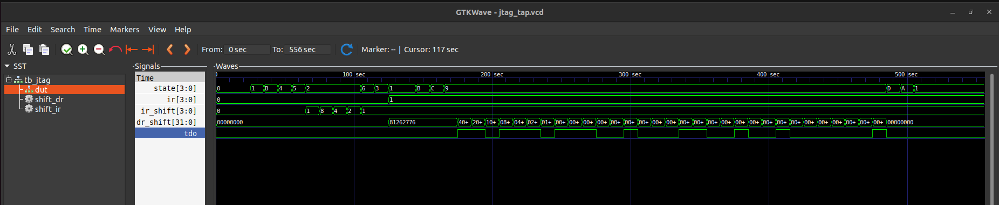

# Minimal JTAG TAP Controller Simulation

## Overview

This project demonstrates the implementation of a JTAG TAP (Test Access Port) controller.

The project focuses on:

* Understanding JTAG architecture
* Implementing a TAP finite state machine (FSM)
* Supporting IDCODE and BYPASS instructions
* Verifying JTAG operation using simulation
* Understanding serial shifting and scan-chain behavior

---

# JTAG Basics

JTAG (Joint Test Action Group) is a serial debug and testing interface.

It is commonly used for:

* FPGA programming
* CPU debugging
* Embedded system testing
* Boundary scan testing

Basic JTAG signals:

| Signal | Purpose            |
| ------ | ------------------ |
| TCK    | JTAG clock         |
| TMS    | TAP FSM control    |
| TDI    | Serial data input  |
| TDO    | Serial data output |
| TRST   | TAP reset          |

---

# TAP Controller

The TAP controller is implemented as a finite state machine (FSM).

This implementation uses the standard 16-state IEEE 1149.1 TAP architecture.

Implemented states include:

* TEST_LOGIC_RESET
* RUN_TEST_IDLE
* SELECT_DR_SCAN
* CAPTURE_DR
* SHIFT_DR
* EXIT1_DR
* PAUSE_DR
* EXIT2_DR
* UPDATE_DR
* SELECT_IR_SCAN
* CAPTURE_IR
* SHIFT_IR
* EXIT1_IR
* PAUSE_IR
* EXIT2_IR
* UPDATE_IR

The FSM transitions are controlled using the `TMS` signal.

---

# Instructions Implemented

## IDCODE

Returns a fixed 32-bit identification value used for:

* Device identification
* JTAG communication verification
* Shift register verification

Example IDCODE:

```text
32'h81262776
```

---

## BYPASS

Implements a 1-bit bypass register used to minimize scan-chain delay.

---

# Project Structure

```text
Task-1/
│
├── riscv.v
├── jtag_tap.v
├── tb_jtag_tap.v
├── VSDSquadronFM.pcf
├── jtag_tap.vcd
└── README.md
```

---

# Implementation Steps

## 1. Study Existing RTL

The existing `riscv.v` top module was studied to understand:

* clock structure
* reset structure
* top-level integration points

---

## 2. Create JTAG TAP Module

A separate `jtag_tap.v` module was created implementing:

* TAP FSM
* Instruction register
* Data register
* IDCODE instruction
* BYPASS instruction

---

## 3. Add JTAG Ports to Top Module

The following JTAG pins were added:

* TCK
* TMS
* TDI
* TDO
* TRST

---

## 4. Implement TAP FSM

The FSM controls:

* instruction shifting
* data shifting
* register updates
* reset handling
* pause and exit transitions

---

## 5. Implement IDCODE and BYPASS

Two JTAG instructions were implemented:

* IDCODE
* BYPASS

---

## 6. Create Self-Checking Testbench

A dedicated Verilog testbench was created to:

* reset TAP
* shift IR
* shift DR
* verify IDCODE readback
* automatically display PASS/FAIL status

---

## 7. FPGA Pin Mapping

Five GPIO pins were selected for:

* TCK
* TMS
* TDI
* TDO
* TRST

Pin mapping was added in `VSDSquadronFM.pcf`.

Example mapping:

```text
set_io tck   9
set_io tms   10
set_io tdi   11
set_io tdo   19
set_io trst  21
```

---

# Simulation Flow

## Compile

```bash
iverilog -o sim jtag_tap.v tb_jtag_tap.v
```

---

## Run

```bash
vvp sim
```

---

## Open Waveform

```bash
gtkwave jtag_tap.vcd
```

---

# Simulation Results

## Terminal Output


The terminal output confirms:

* Correct TDO serial shifting
* Successful IDCODE readback
* PASS condition from self-checking testbench

---

## GTKWave Verification



The waveform confirms:

* Correct TAP FSM transitions
* Successful IR shifting
* IDCODE loading
* DR shifting
* Correct TDO behavior

---

# Important Signals Observed

| Signal   | Description                |
| -------- | -------------------------- |
| state    | TAP FSM state              |
| ir       | Active instruction         |
| ir_shift | Instruction shift register |
| dr_shift | Data shift register        |
| idcode   | Fixed device ID            |
| tdo      | Serial output              |

---

# Conclusion

A complete educational JTAG TAP controller was successfully implemented and verified in simulation.

The design supports:

* Full TAP FSM operation
* IDCODE instruction
* BYPASS instruction
* IR shifting
* DR shifting
* Serial TDO output
* Self-checking verification

Simulation and waveform analysis confirmed correct JTAG behavior and successful IDCODE readback.
