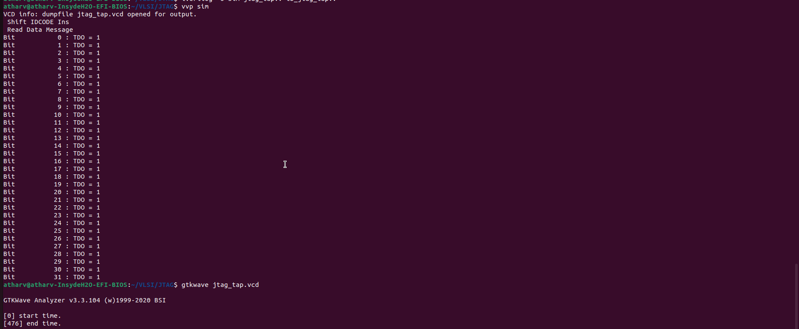
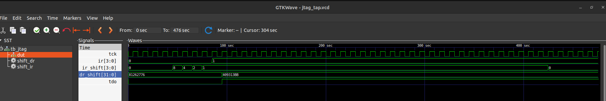

# Minimal JTAG TAP Controller Integration with VSDSquadron RISC-V RTL

## Overview

This project demonstrates the implementation of a simplified JTAG TAP (Test Access Port) controller.

The project focuses on:

* Understanding JTAG architecture
* Implementing a TAP FSM
* Supporting IDCODE and BYPASS instructions
* Verifying JTAG operation in simulation
  
---

# JTAG Basics

JTAG (Joint Test Action Group) is a serial debug and test interface.
Basic JTAG signals:

| Signal | Purpose            |
| ------ | ------------------ |
| TCK    | JTAG clock         |
| TMS    | TAP state control  |
| TDI    | Serial data input  |
| TDO    | Serial data output |
| TRST   | TAP reset          |

---

# TAP Controller

The TAP controller is implemented as a finite state machine (FSM).

Implemented states:

* TEST_LOGIC_RESET
* RUN_TEST_IDLE
* SHIFT_IR
* UPDATE_IR
* SHIFT_DR
* UPDATE_DR

The TAP FSM is controlled using the TMS signal.

---

# Instructions Implemented

## IDCODE

Returns a fixed 32-bit identification value used for device identification and verification.

## BYPASS

Implements a 1-bit bypass register used to minimize scan-chain delay.

---

# Project Structure

```text
project/
│
├── riscv.v
├── jtag_tap.v
├── tb_jtag_tap.v
├── VSDSquadronFM.pcf
├── jtag_tap.vcd
└── README.md
```

---

# Implementation Steps

## 1. Study Existing RTL

The existing `riscv.v` top module was studied to understand:

* clock structure
* reset structure
* top-level integration points

---

## 2. Create JTAG TAP Module

A separate `jtag_tap.v` module was created implementing:

* TAP FSM
* Instruction register
* Data register
* IDCODE instruction
* BYPASS instruction

---

## 3. Add JTAG Ports to Top Module

JTAG pins were added to the top-level RISC-V RTL.

---

## 4. Implement TAP FSM

The FSM controls:

* instruction shifting
* data shifting
* register updates
* reset handling

---

## 5. Implement IDCODE and BYPASS

Two basic JTAG instructions were implemented:

* IDCODE
* BYPASS

---

## 6. Create Testbench

A dedicated Verilog testbench was created to:

* reset TAP
* shift IR
* shift DR
* verify IDCODE readback

---

## 7. FPGA Pin Mapping

Four free GPIO pins were selected for:

* TCK
* TMS
* TDI
* TDO

Pin mapping was added in `VSDSquadronFM.pcf`.

---

# Simulation Flow

## Compile

```bash
iverilog -o sim jtag_tap.v tb_jtag_tap.v
```

## Run

```bash
vvp sim
```

## Open Waveform

```bash
gtkwave jtag_tap.vcd
```

---

# Simulation Results

## Terminal Output


## GTKWave Verification


The waveform confirms:

Correct TAP FSM transitions
Successful IR shifting
IDCODE loading
DR shifting
Serial TDO behavior

# Important Signals Observed

| Signal   | Description                |
| -------- | -------------------------- |
| state    | TAP FSM state              |
| ir       | Active instruction         |
| ir_shift | Instruction shift register |
| dr_shift | Data shift register        |
| tdo      | Serial output              |

---

# Conclusion

A simplified JTAG TAP controller was successfully implemented and verified in simulation.

The design supports:

* TAP FSM operation
* IDCODE instruction
* BYPASS instruction
* IR/DR shifting
* Serial TDO output

Waveform analysis confirmed correct JTAG behavior.

A simplified JTAG TAP controller was successfully implemented and simulated.

The design supports:

* IDCODE instruction
* BYPASS instruction
* IR shifting
* DR shifting
* TAP FSM control

Simulation verified correct JTAG behavior using GTKWave waveforms.

