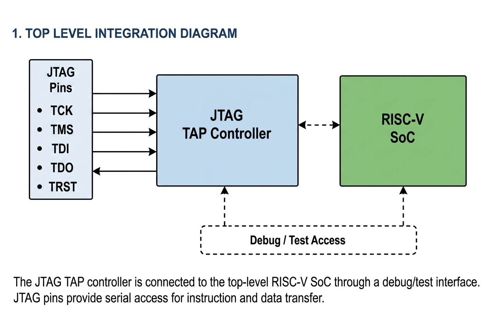
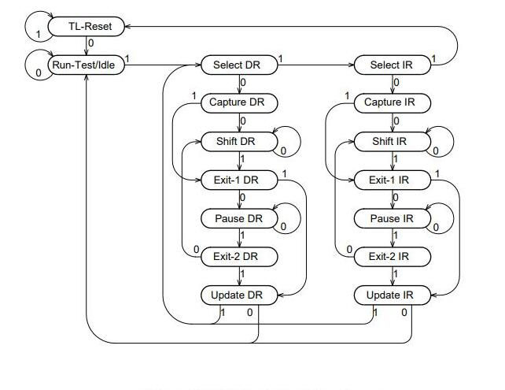
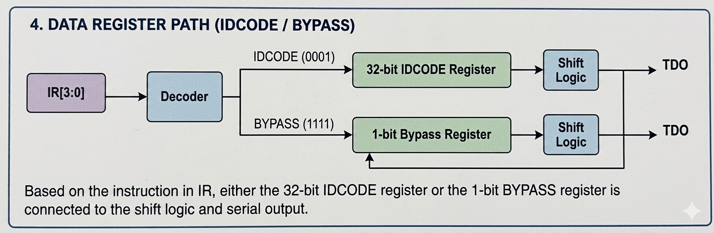
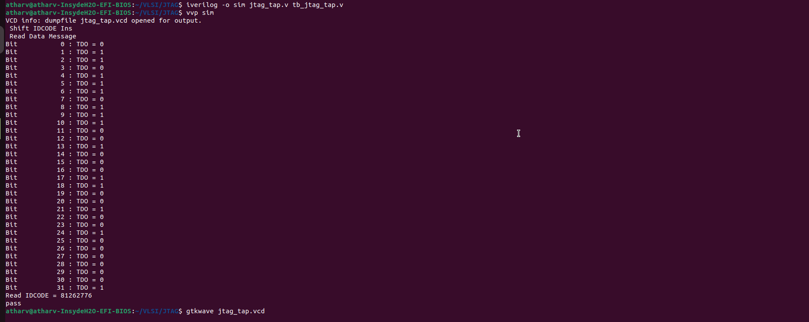
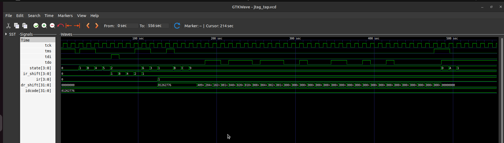

# Minimal JTAG TAP Controller Integration

## Project Overview

This project implements a minimal IEEE 1149.1 JTAG TAP (Test Access Port) controller.

The implementation includes:

* Full 16-state TAP FSM
* IDCODE instruction support
* BYPASS instruction support
* Self-checking Verilog testbench
* GTKWave verification
* FPGA pin mapping for JTAG signals

The project focuses on understanding JTAG protocol behavior, TAP state transitions and serial scan-chain operation.

---

# JTAG Overview

JTAG (Joint Test Action Group) is a serial debug and testing interface.

It is commonly used for:

* FPGA programming
* CPU debugging
* Embedded system testing
* Boundary scan testing

Basic JTAG signals:

| Signal | Purpose            |
| ------ | ------------------ |
| TCK    | JTAG clock         |
| TMS    | TAP FSM control    |
| TDI    | Serial data input  |
| TDO    | Serial data output |
| TRST   | TAP reset          |

---

# System Architecture

The JTAG TAP controller will be connected to the top-level RISC-V SoC through a debug/test interface.

The TAP receives serial control and data through standard JTAG signals:

* TCK
* TMS
* TDI
* TDO
* TRST

---

## Top-Level Integration Diagram



---

# JTAG TAP Controller Architecture

The TAP controller consists of:

* TAP FSM
* Instruction Register (IR)
* Instruction Decoder
* Data Register (DR)
* BYPASS Register
* TDO Output Logic

The FSM controls instruction shifting, data shifting, register updates, and TAP state transitions.

Supported Instructions:

| Instruction | Opcode | Description               |
| ----------- | ------ | ------------------------- |
| IDCODE      | `0001` | Returns 32-bit device ID  |
| BYPASS      | `1111` | Enables 1-bit bypass path |

---

## TAP Controller Architecture Diagram


---

# TAP State Machine

The implementation uses the standard IEEE 1149.1 16-state TAP FSM.

Implemented states include:

* TEST_LOGIC_RESET
* RUN_TEST_IDLE
* SELECT_DR_SCAN
* CAPTURE_DR
* SHIFT_DR
* EXIT1_DR
* PAUSE_DR
* EXIT2_DR
* UPDATE_DR
* SELECT_IR_SCAN
* CAPTURE_IR
* SHIFT_IR
* EXIT1_IR
* PAUSE_IR
* EXIT2_IR
* UPDATE_IR

State transitions are controlled using the `TMS` signal.

---

## TAP FSM Diagram



---

# Data Register Path

The active instruction in the IR selects the active data path.

* `IDCODE` selects the 32-bit ID register
* `BYPASS` selects the 1-bit bypass register

The selected register is connected to the shift logic and serially shifted through TDO.

---

## Data Path Diagram



---

# FPGA Pin Mapping

Five FPGA GPIO pins were allocated for the JTAG interface.

| Signal | Direction | Purpose            |
| ------ | --------- | ------------------ |
| TCK    | Input     | JTAG Clock         |
| TMS    | Input     | TAP State Control  |
| TDI    | Input     | Serial Data Input  |
| TDO    | Output    | Serial Data Output |
| TRST   | Input     | TAP Reset          |

Example PCF Mapping:

```text
# =========================
# JTAG Interface Pins
# =========================

set_io tck   9
set_io tms   10
set_io tdi   11
set_io tdo   19
set_io trst  21
```

---

# Project Structure

```text
Task-1/src
│
├── riscv.v
├── jtag_tap.v
├── tb_jtag_tap.v
├── VSDSquadronFM.pcf
├── jtag_tap.vcd
└── README.md
```

---

# Simulation Flow

## Compile

```bash
iverilog -o sim jtag_tap.v tb_jtag_tap.v
```

## Run Simulation

```bash
vvp sim
```

## Open GTKWave

```bash
gtkwave jtag_tap.vcd
```# Minimal JTAG TAP Controller Integration with RISC-V RTL

## Project Overview

This project implements a minimal IEEE 1149.1 JTAG TAP (Test Access Port) controller.

The implementation includes:

* Full 16-state TAP FSM
* IDCODE instruction support
* BYPASS instruction support
* Self-checking Verilog testbench
* GTKWave verification
* FPGA pin mapping for JTAG signals

The project focuses on understanding JTAG protocol behavior, TAP state transitions, serial scan-chain operation, and RTL verification methodology.

---

# JTAG Overview

JTAG (Joint Test Action Group) is a serial debug and testing interface.

It is commonly used for:

* FPGA programming
* CPU debugging
* Embedded system testing
* Boundary scan testing

Basic JTAG signals:

| Signal | Purpose            |
| ------ | ------------------ |
| TCK    | JTAG clock         |
| TMS    | TAP FSM control    |
| TDI    | Serial data input  |
| TDO    | Serial data output |
| TRST   | TAP reset          |

---

# System Architecture

The JTAG TAP controller is connected to the top-level RISC-V SoC through a debug/test interface.

The TAP receives serial control and data through standard JTAG signals:

* TCK
* TMS
* TDI
* TDO
* TRST

---

## Top-Level Integration Diagram


---

# JTAG TAP Controller Architecture

The TAP controller consists of:

* TAP FSM
* Instruction Register (IR)
* Instruction Decoder
* Data Register (DR)
* BYPASS Register
* TDO Output Logic

The FSM controls instruction shifting, data shifting, register updates, and TAP state transitions.

Supported Instructions:

| Instruction | Opcode | Description               |
| ----------- | ------ | ------------------------- |
| IDCODE      | `0001` | Returns 32-bit device ID  |
| BYPASS      | `1111` | Enables 1-bit bypass path |

---

## TAP Controller Architecture Diagram


---

# TAP State Machine

The implementation uses the standard IEEE 1149.1 16-state TAP FSM.

Implemented states include:

* TEST_LOGIC_RESET
* RUN_TEST_IDLE
* SELECT_DR_SCAN
* CAPTURE_DR
* SHIFT_DR
* EXIT1_DR
* PAUSE_DR
* EXIT2_DR
* UPDATE_DR
* SELECT_IR_SCAN
* CAPTURE_IR
* SHIFT_IR
* EXIT1_IR
* PAUSE_IR
* EXIT2_IR
* UPDATE_IR

State transitions are controlled using the `TMS` signal.

---

## TAP FSM Diagram


---

# Data Register Path

The active instruction in the IR selects the active data path.

* `IDCODE` selects the 32-bit ID register
* `BYPASS` selects the 1-bit bypass register

The selected register is connected to the shift logic and serially shifted through TDO.

---

## Data Path Diagram


---

# FPGA Pin Mapping

Five FPGA GPIO pins were allocated for the JTAG interface.

| Signal | Direction | Purpose            |
| ------ | --------- | ------------------ |
| TCK    | Input     | JTAG Clock         |
| TMS    | Input     | TAP State Control  |
| TDI    | Input     | Serial Data Input  |
| TDO    | Output    | Serial Data Output |
| TRST   | Input     | TAP Reset          |

Example PCF Mapping:

```text
# =========================
# JTAG Interface Pins
# =========================

set_io tck   9
set_io tms   10
set_io tdi   11
set_io tdo   19
set_io trst  21
```

---

# Project Structure

```text
project/
│
├── riscv.v
├── jtag_tap.v
├── tb_jtag_tap.v
├── VSDSquadronFM.pcf
├── jtag_tap.vcd
└── README.md
```

---

# Simulation Flow

## Compile

```bash
iverilog -o sim jtag_tap.v tb_jtag_tap.v
```

## Run Simulation

```bash
vvp sim
```

## Open GTKWave

```bash
gtkwave jtag_tap.vcd
```

---

# Verification Results

The design was verified using:

* Self-checking testbench
* Serial TDO monitoring
* GTKWave waveform analysis

Verification confirms:

* Correct TAP FSM transitions
* Correct IR shifting
* Correct DR shifting
* Proper IDCODE readback
* Correct TDO serial output

---

# Terminal Output


The terminal output confirms:

* Successful IDCODE readback
* Correct self-checking PASS condition
* Proper serial TDO shifting during DR scan

---

# GTKWave Verification


The waveform confirms:

* Correct TAP FSM transitions
* Successful IR shifting and instruction loading
* Proper DR shifting behavior
* Correct serial TDO output during SHIFT_DR

Observed FSM sequence:

```text
TEST_LOGIC_RESET
→ RUN_TEST_IDLE
→ SHIFT_IR
→ UPDATE_IR
→ SHIFT_DR
→ UPDATE_DR
```

---

# Key Debugging Challenges

During implementation several RTL debugging issues were resolved:

* FSM transition mismatches
* TDO sampling alignment
* Multiple-driver TDO conflicts
* Shift timing synchronization
* Nonblocking assignment timing
* Serial scan alignment

These issues were debugged using GTKWave waveform analysis and iterative RTL refinement.

---

# Final Result

The final implementation successfully demonstrates:

* Full IEEE 1149.1 TAP FSM
* IDCODE instruction support
* BYPASS instruction support
* Self-checking verification
* Correct serial scan-chain behavior
* Successful simulation-level integration with RISC-V RTL

The project provides a foundational educational implementation of a JTAG debug interface suitable for further RISC-V debug integration and FPGA hardware experimentation.

---


---

# Verification Results

The design was verified using:

* Self-checking testbench
* Serial TDO monitoring
* GTKWave waveform analysis

Verification confirms:

* Correct TAP FSM transitions
* Correct IR shifting
* Correct DR shifting
* Proper IDCODE readback
* Correct TDO serial output

---

# Terminal Output



The terminal output confirms:

* Successful IDCODE readback
* Correct self-checking PASS condition
* Proper serial TDO shifting during DR scan

---

# GTKWave Verification



The waveform confirms:

* Correct TAP FSM transitions
* Successful IR shifting and instruction loading
* Proper DR shifting behavior
* Correct serial TDO output during SHIFT_DR

Observed FSM sequence:

```text
TEST_LOGIC_RESET
→ RUN_TEST_IDLE
→ SHIFT_IR
→ UPDATE_IR
→ SHIFT_DR
→ UPDATE_DR
```

---

# Conclusion

The final implementation successfully demonstrates:

* Full IEEE 1149.1 TAP FSM
* IDCODE instruction support
* BYPASS instruction support
* Self-checking verification
* Correct serial scan-chain behavior
* Successful simulation-level integration 

---
