# Task 2 – JTAG-Based RISC-V Processor Debug Interface

## Project Overview

Task 2 extends the JTAG Test Access Port (TAP) implemented in Task 1 by integrating it with the RISC-V processor. The objective is to enable processor debugging through the JTAG interface by providing external control and monitoring capabilities.

The implemented debug system supports:

* Reading Device Identification Code (IDCODE)
* Processor Halt Control
* Processor Resume Control
* Processor Reset Control
* Processor Halt Status Monitoring
* Program Counter (PC) Monitoring

The design allows a host system to observe and control processor execution through standard JTAG transactions.

---

# Objectives

The primary objectives of Task 2 are:

1. Extend the JTAG TAP controller with debug instructions.
2. Connect the JTAG interface to the RISC-V processor.
3. Implement processor halt and resume functionality.
4. Expose processor status information through JTAG.
5. Expose the Program Counter through JTAG.
6. Verify functionality through simulation and waveform analysis.

---

# JTAG Instructions Implemented

| Instruction  | Opcode  | Description                     |
| ------------ | ------- | ------------------------------- |
| IDCODE       | 4'b0001 | Read Device Identification Code |
| DEBUG_CTRL   | 4'b0010 | Processor Control Register      |
| DEBUG_STATUS | 4'b0011 | Processor Status Register       |
| DEBUG_PC     | 4'b0100 | Program Counter Register        |
| BYPASS       | 4'b1111 | 1-bit Bypass Register           |

---

# Theory

## JTAG Debug Interface

JTAG (IEEE 1149.1) provides a serial communication interface that allows external access to internal registers of a digital system.

The TAP controller receives serial instructions through TDI and interprets them using the Instruction Register (IR). Based on the selected instruction, the corresponding data source is connected to the Data Register (DR).

The Data Register contents are shifted serially through TDO.

---

## Processor Debug Operations

### HALT Operation

When a HALT command is issued through the DEBUG_CTRL instruction:

```verilog
debug_halt_req = 1;
```

the processor enters debug mode:

```verilog
debug_halted <= 1;
```

and Program Counter updates stop.

---

### RESUME Operation

When a RESUME command is issued:

```verilog
debug_resume_req = 1;
```

the halted state is cleared:

```verilog
debug_halted <= 0;
```

and processor execution continues.

---

### RESET Operation

When a RESET command is issued:

```verilog
debug_reset_req = 1;
```

the processor is reset and execution restarts from the reset vector.

---

### Debug Status Monitoring

The DEBUG_STATUS instruction returns:

```verilog
{31'b0, debug_halted}
```

where:

```text
0 = Processor Running
1 = Processor Halted
```

---

### Program Counter Monitoring

The DEBUG_PC instruction returns:

```verilog
debug_pc[31:0]
```

allowing real-time observation of processor execution.

---

# System Architecture

## JTAG TAP and RISC-V Debug Interface Block Diagram

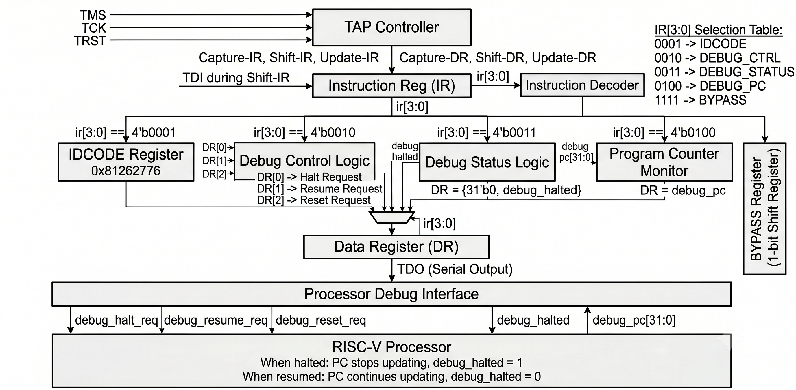

*Figure 1: Detailed JTAG TAP and RISC-V Debug Interface Architecture.*

The architecture consists of:

### TAP Controller

Implements the IEEE 1149.1 state machine and controls:

* Capture-IR
* Shift-IR
* Update-IR
* Capture-DR
* Shift-DR
* Update-DR

---

### Instruction Register (IR)

Stores the currently active JTAG instruction.

Supported instructions:

```text
0001 -> IDCODE
0010 -> DEBUG_CTRL
0011 -> DEBUG_STATUS
0100 -> DEBUG_PC
1111 -> BYPASS
```

---

### Instruction Decoder

Decodes the Instruction Register contents and selects the corresponding register path.

---

### IDCODE Register

Stores the device identification code:

```text
0x81262776
```

---

### Debug Control Logic

Activated when:

```text
IR = 0010
```

Control bits:

```text
DR[0] -> Halt Request
DR[1] -> Resume Request
DR[2] -> Reset Request
```

---

### Debug Status Logic

Activated when:

```text
IR = 0011
```

Returns:

```text
DR = {31'b0, debug_halted}
```

---

### Program Counter Monitor

Activated when:

```text
IR = 0100
```

Returns:

```text
DR = debug_pc
```

---

### Data Register (DR)

Acts as the active shift register during data transfers and serially outputs data through TDO.

---

### Processor Debug Interface

The TAP controller communicates with the processor through:

```verilog
debug_halt_req
debug_resume_req
debug_reset_req

debug_halted
debug_pc[31:0]
```

---

### RISC-V Processor

The processor debug logic implements:

```verilog
if(debug_halt_req)
    debug_halted <= 1'b1;

if(debug_resume_req)
    debug_halted <= 1'b0;

if(!debug_halted)
    PC <= nextPC;
```

This ensures that execution stops during HALT and resumes when requested.

---

# Processor Modifications

The processor module was extended with the following ports:

```verilog
input  debug_halt_req;
input  debug_resume_req;
input  debug_reset_req;

output reg debug_halted;
output [31:0] debug_pc;
```

The Program Counter is exported using:

```verilog
assign debug_pc = PC;
```

---

# Verification Methodology

Verification was performed in two stages:

## Stage 1 – JTAG TAP Verification

The TAP controller was verified independently using:

```text
tb_jtag_tap.v
```

The following instructions were tested:

* IDCODE
* DEBUG_STATUS
* DEBUG_PC
* DEBUG_CTRL

---

## Stage 2 – Processor Debug Verification

The processor debug interface was verified using:

```text
tb_processor_debug.v
```

The following functionality was tested:

* CPU Running
* HALT Accepted
* PC Frozen
* RESUME Accepted
* PC Running Again

---

# Simulation Commands

## JTAG TAP Verification

### Compile

```bash
iverilog -g2012 -DBENCH -DSIMULATION \
-s tb_jtag \
-o simv \
tb_jtag_tap.v \
jtag_tap.v
```

### Run

```bash
vvp simv
```

---

## Processor Debug Verification

### Compile

```bash
iverilog -g2012 -DBENCH -DSIMULATION \
-s tb_processor_debug \
-o simv \
tb_processor_debug.v \
riscv.v
```

### Run

```bash
vvp simv
```

---

# Verification Results

## A. JTAG TAP Verification

### DEBUG_STATUS Verification

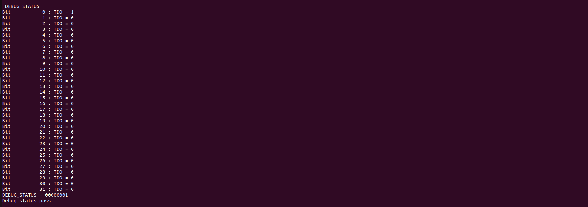

*Figure 2: Terminal output showing successful execution of the DEBUG_STATUS instruction and correct retrieval of the processor halt status.*

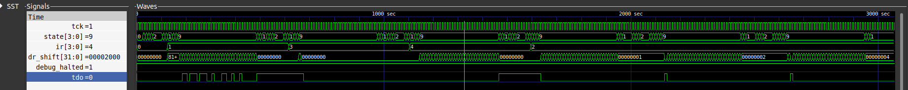

*Figure 3: GTKWave waveform showing DEBUG_STATUS instruction loading the halt status into the Data Register and shifting the value through TDO.*

Signals displayed:

```text
tck
state
ir
dr_shift
debug_halted
tdo
```

---

### DEBUG_PC Verification

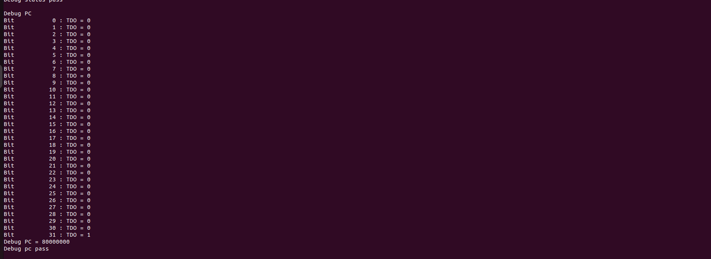

*Figure 4: Terminal output showing successful execution of the DEBUG_PC instruction and retrieval of the current Program Counter value.*

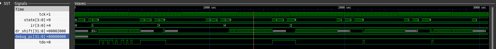

*Figure 5: GTKWave waveform showing DEBUG_PC instruction loading the Program Counter into the Data Register and serially transmitting it through TDO.*

Signals displayed:

```text
tck
state
ir
dr_shift
debug_pc
tdo
```

---

### DEBUG_CTRL HALT Verification

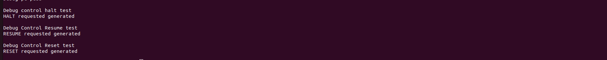

*Figure 6: Terminal output confirming successful generation of a HALT request through the DEBUG_CTRL instruction.*


*Figure 7: GTKWave waveform showing assertion of debug_halt_req generated from DEBUG_CTRL register bit 0.*

Signals displayed:

```text
tck
state
ir
dr_shift

debug_halt_req
debug_resume_req
debug_reset_req
```

---

### DEBUG_CTRL RESUME Verification


*Figure 8: Terminal output confirming successful generation of a RESUME request through the DEBUG_CTRL instruction.*


*Figure 9: GTKWave waveform showing assertion of debug_resume_req generated from DEBUG_CTRL register bit 1.*

Signals displayed:

```text
tck
state
ir
dr_shift

debug_halt_req
debug_resume_req
debug_reset_req
```

---

### DEBUG_CTRL RESET Verification


*Figure 10: Terminal output confirming successful generation of a RESET request through the DEBUG_CTRL instruction.*

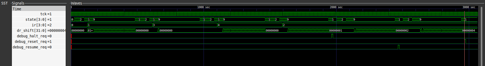

*Figure 11: GTKWave waveform showing assertion of debug_reset_req generated from DEBUG_CTRL register bit 2.*

Signals displayed:

```text
tck
state
ir
dr_shift

debug_halt_req
debug_resume_req
debug_reset_req
```

---

## B. Processor Debug Verification

### CPU Running

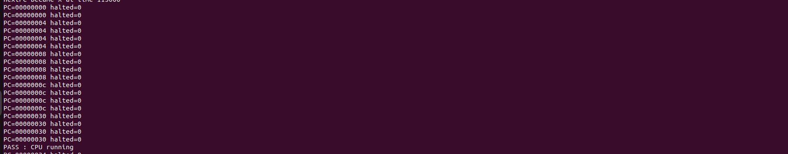

*Figure 12: Terminal output confirming that the processor executes instructions normally before entering debug mode.*

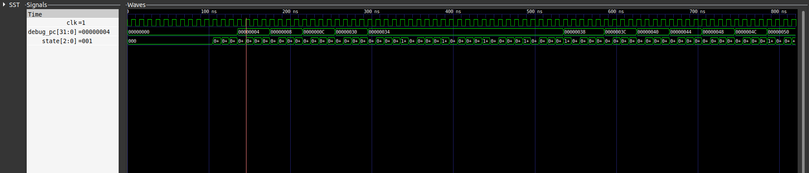

*Figure 13: GTKWave waveform showing the Program Counter continuously incrementing, indicating active instruction execution.*

Signals displayed:

```text
debug_pc
state
```

---

### HALT Accepted

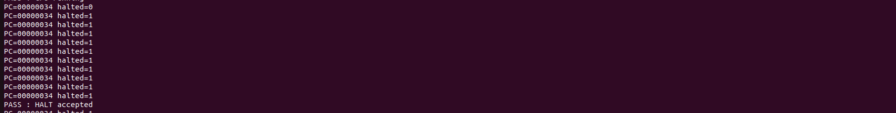

*Figure 14: Terminal output confirming successful acceptance of the HALT request.*

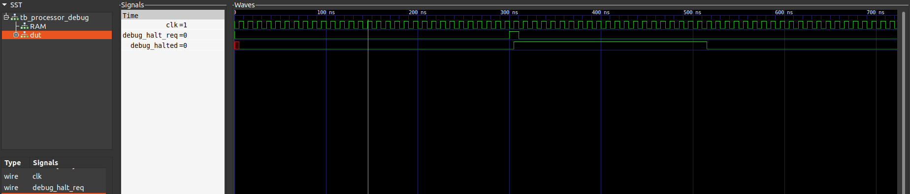

*Figure 15: GTKWave waveform showing assertion of debug_halt_req followed by debug_halted transitioning to logic high.*

Signals displayed:

```text
debug_halt_req
debug_halted
```

---

### PC Frozen

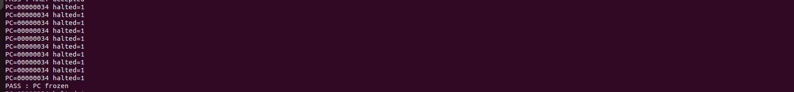

*Figure 16: Terminal output confirming that the Program Counter remains constant while the processor is halted.*

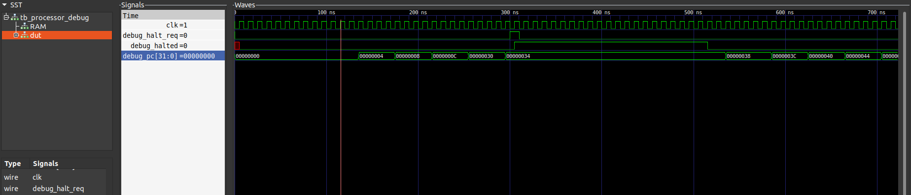

*Figure 17: GTKWave waveform showing a constant Program Counter value while debug_halted remains asserted.*

Signals displayed:

```text
debug_halt_req
debug_halted
debug_pc
```

---

### RESUME Accepted

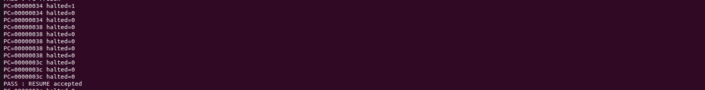

*Figure 18: Terminal output confirming successful acceptance of the RESUME request.*

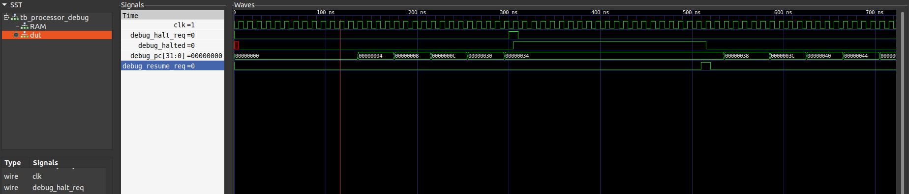

*Figure 19: GTKWave waveform showing assertion of debug_resume_req followed by deassertion of debug_halted.*

Signals displayed:

```text
debug_halt_req
debug_halted
debug_pc
debug_resume_req
```

---

### PC Running Again

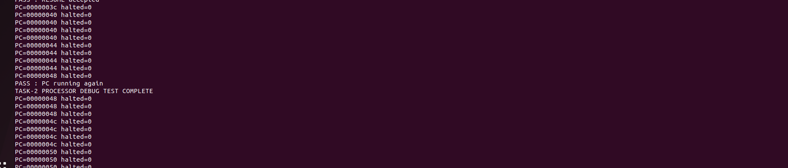

*Figure 20: Terminal output confirming successful continuation of processor execution after resume.*

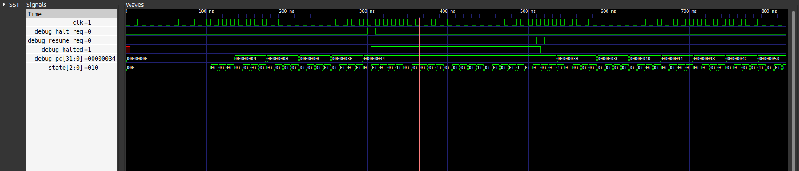

*Figure 21: GTKWave waveform showing Program Counter increments after debug_halted is cleared.*

Signals displayed:

```text
debug_halt_req
debug_resume_req
debug_halted
debug_pc
state
```

---

# Final Simulation Output

```text
PASS : CPU running
PASS : HALT accepted
PASS : PC frozen
PASS : RESUME accepted
PASS : PC running again

TASK-2 PROCESSOR DEBUG TEST COMPLETE
```

---

# Conclusion

Task 2 successfully integrates the JTAG TAP controller with the RISC-V processor and implements a functional debug interface. The processor can be halted, resumed, reset, and monitored externally through JTAG instructions. Verification through simulation and waveform analysis confirms correct operation of all implemented debug features. The design establishes a robust foundation for FPGA-based processor debugging and future extensions such as register inspection and memory access.

