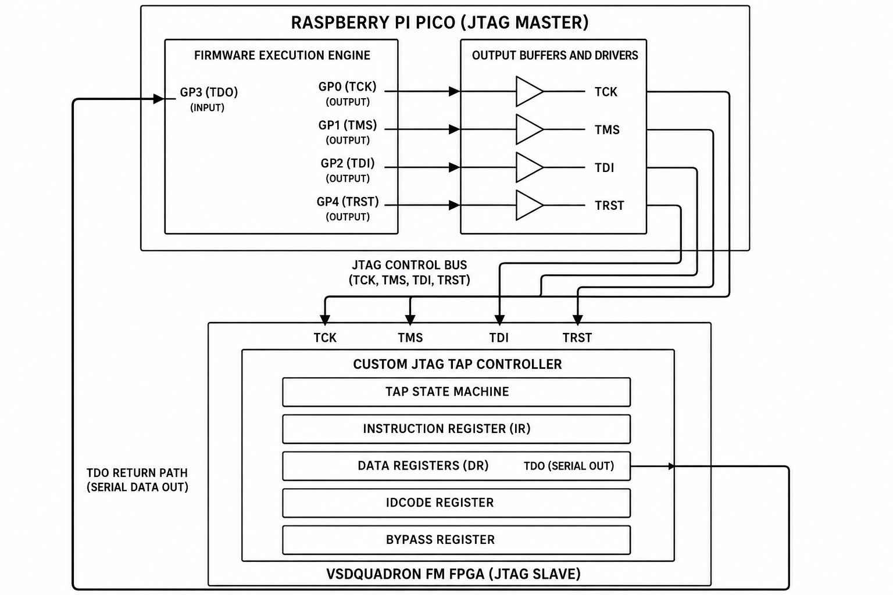
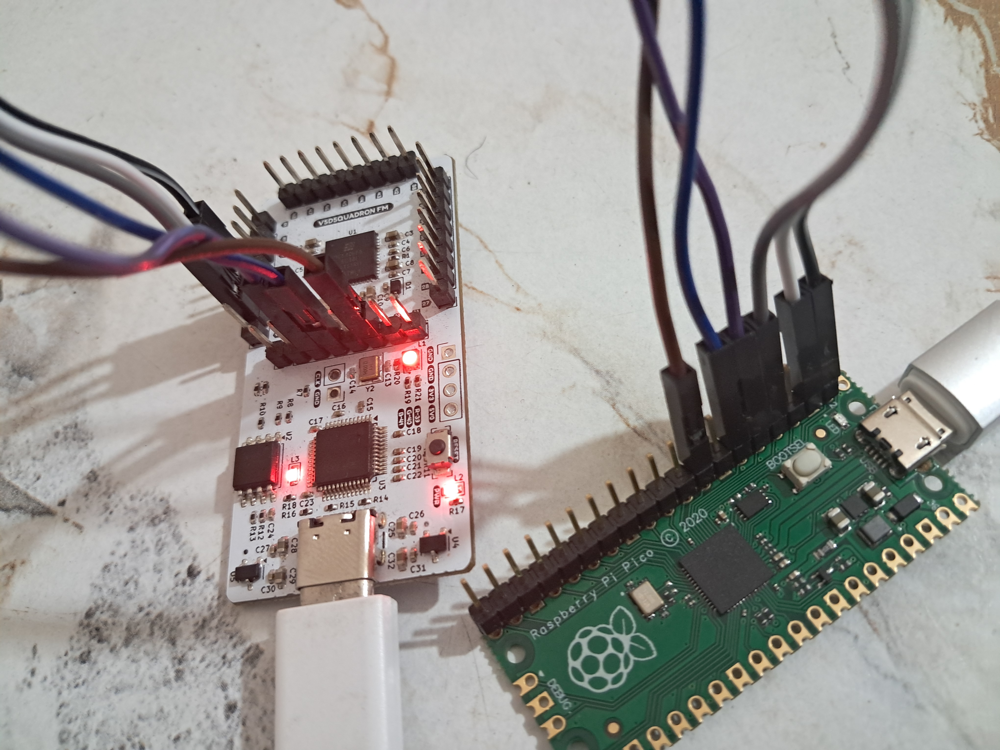
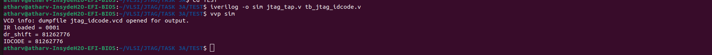
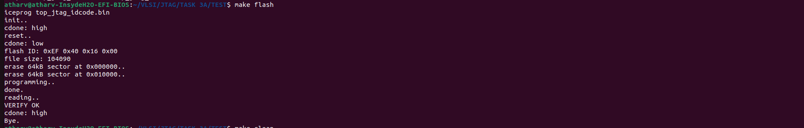
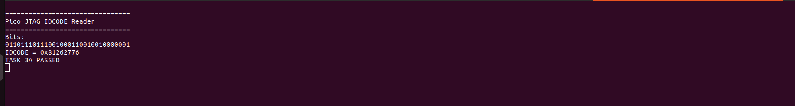

# Task 3A – Custom JTAG TAP Controller and IDCODE Verification

## Overview

This project implements a custom IEEE 1149.1-style JTAG Test Access Port (TAP) controller on the VSDSquadron FM FPGA and verifies its functionality using an external Raspberry Pi Pico configured as a software-based JTAG master, while FT2232H/ OpenOCD/ Ashling validation will be a later task.

The objective of Task 3A was to successfully access the FPGA through the JTAG interface and read the device identification code (IDCODE) through the implemented TAP controller.

**Expected IDCODE**

```text
0x81262776
```

**Observed IDCODE**

```text
0x81262776
```

**Status**

```text
TASK 3A PASSED
```

---

# System Architecture

The verification setup consists of two major components:

1. **Raspberry Pi Pico**

   * Acts as an external JTAG master.
   * Generates TCK, TMS, TDI and TRST signals.
   * Samples TDO from the FPGA.
   * Executes TAP reset, instruction loading and data shifting sequences.

2. **VSDSquadron FM FPGA**

   * Implements a custom JTAG TAP controller in Verilog.
   * Supports Instruction Register (IR) operations.
   * Supports Data Register (DR) operations.
   * Contains a 32-bit IDCODE register.



---

# Repository Structure

```text
Task-3A/
│
├── src/
│   ├── jtag_tap.v
│   └── top_jtag_idcode.v
│   └── VSDSquadronFM.pcf
│   └── pico_jtag_idcode_reader.ino
│   └── tb_jtag_idcode.v
│   └── Makefile
│
├── images/
│   ├── 01_fpga_programming.png
│   ├── 02_jtag_wiring.jpg
│   ├── 03_simulation_pass.png
│   ├── 04_pico_idcode_read.png
│   └── 05_block_diagram.png
│
└── README.md
```

---

# Hardware Setup

## FPGA Pin Mapping

| Signal | FPGA Pin |
| ------ | -------- |
| TCK    | 9        |
| TMS    | 10       |
| TDI    | 11       |
| TDO    | 19       |
| TRST   | 21       |
| LED    | 39       |

## Raspberry Pi Pico Connections

| Pico GPIO | FPGA Pin | Signal |
| --------- | -------- | ------ |
| GP0       | 9        | TCK    |
| GP1       | 10       | TMS    |
| GP2       | 11       | TDI    |
| GP3       | 19       | TDO    |
| GP4       | 21       | TRST   |
| GND       | GND      | Ground |

### Hardware Wiring



---

# JTAG TAP Implementation

The custom TAP controller implements:

* TAP State Machine
* Instruction Register (IR)
* Data Register (DR)
* IDCODE Instruction (`0001`)
* BYPASS Instruction (`1111`)

The IDCODE register is initialized with:

```verilog
32'h81262776
```

During operation:

1. TAP Reset
2. Transition to Shift-IR
3. Load IDCODE instruction
4. Transition to Shift-DR
5. Shift out 32-bit IDCODE through TDO
6. Reconstruct IDCODE on the Pico

---

# Simulation Verification

Prior to hardware deployment, the design was verified using Icarus Verilog.

## Run Simulation

```bash
iverilog -o sim rtl/jtag_tap.v sim/tb_jtag_idcode.v
vvp sim
```

## Simulation Result

```text
IR loaded = 0001
IDCODE = 81262776
```



The simulation confirms:

* Correct TAP state transitions
* Successful instruction loading
* Correct IDCODE capture
* Proper DR shifting behaviour

---

# FPGA Programming

The FPGA bitstream was generated using Yosys and nextpnr and programmed using iceprog.

## Build

```bash
make build
```

## Flash

```bash
make flash
```

### Programming Result



---

# External JTAG Verification Using Raspberry Pi Pico

Instead of a dedicated FT2232H-based JTAG adapter, a Raspberry Pi Pico was used as a software-driven JTAG master.

The Pico firmware performs:

* TAP Reset
* Instruction Register loading
* Data Register capture
* Serial shifting of IDCODE bits
* Reconstruction of the 32-bit device identification code

## Pico Terminal Output

```text
================================
Pico JTAG IDCODE Reader
================================

Bits:
01101110111001000110010010000001

IDCODE = 0x81262776

TASK 3A PASSED
```



---

# Conclusion

A custom JTAG TAP controller was successfully implemented and verified on the VSDSquadron FM FPGA.

Using a Raspberry Pi Pico as an external JTAG master, the FPGA was accessed through the JTAG interface and the expected 32-bit IDCODE value was successfully retrieved:

```text
0x81262776
```

This confirms correct implementation of the TAP state machine, instruction register, data register and external JTAG communication path.

**Task 3A Successfully Completed.**
