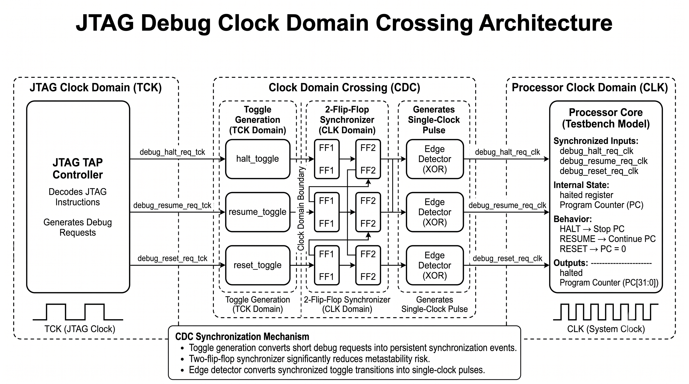
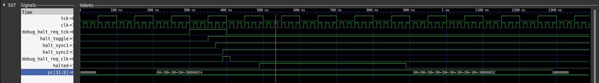
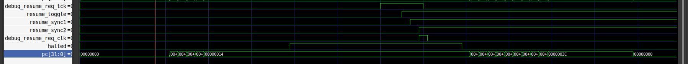
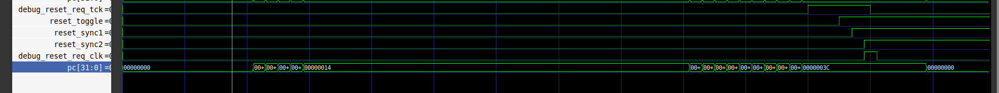
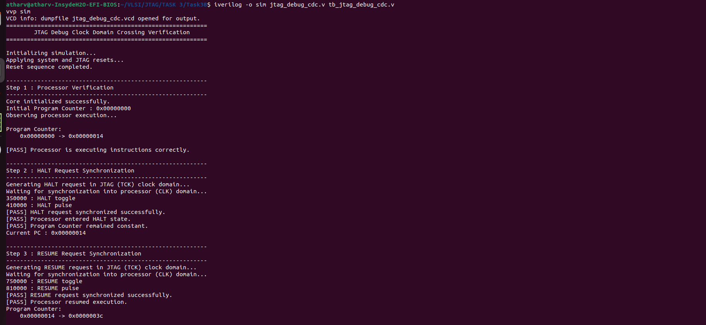
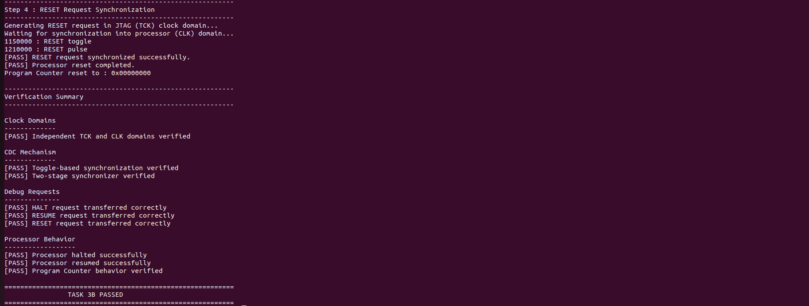

# Task 3B – JTAG Debug Clock Domain Crossing (CDC)

> **Implementation and verification of a toggle-based two-flip-flop synchronizer for safely transferring JTAG debug requests between asynchronous clock domains using Verilog HDL.**

---

# 1. Overview

This project implements a **Clock Domain Crossing (CDC)** mechanism for a JTAG debug interface. The objective is to safely transfer asynchronous debug requests generated in the **JTAG clock domain (TCK)** into the **processor clock domain (CLK)** without introducing metastability or losing short debug pulses.

A **toggle-based synchronization technique** combined with a **two-stage flip-flop synchronizer** is used to reliably transfer three debug commands:

* HALT
* RESUME
* RESET

The design is implemented in **Verilog HDL** and functionally verified using **Icarus Verilog** and **GTKWave**.

---

# 2. Objectives

* Implement a reliable Clock Domain Crossing (CDC) mechanism.
* Synchronize JTAG debug requests across asynchronous clock domains.
* Generate single-clock pulses in the processor clock domain.
* Verify HALT, RESUME, and RESET operations.
* Demonstrate correct processor behavior through simulation.

---

# 3. Repository Structure

```text
Task3B/
├──  src/
│   ├── jtag_debug_cdc.v          # CDC implementation
│   └── tb_jtag_debug_cdc.v       # Self-checking testbench
│
├── README.md
│
└── images/
    ├── 01_CDC_Architecture.png
    ├── 02_halt_sync.png
    ├── 03_resume_sync.png
    ├── 04_reset_sync.png
    ├── 05_logsA.png
    └── 06_logsB.png
```

---

# 4. Clock Domain Crossing (CDC)

Digital systems often contain multiple clock domains operating at different frequencies. Signals crossing between these domains may violate setup and hold timing requirements, leading to **metastability** or loss of short pulses.

To overcome this issue, this implementation uses a **toggle-based synchronization scheme**. Instead of transferring a narrow pulse directly, the request toggles a register in the JTAG clock domain. This toggle is synchronized into the processor clock domain using a **two-flip-flop synchronizer**, after which an **edge detector** regenerates a single-clock pulse for the processor.

This technique provides reliable event transfer while significantly reducing the probability of metastability propagating into downstream logic.

---

# 5. System Architecture

> **Figure 1 – JTAG Debug Clock Domain Crossing Architecture**

**

## Architecture Description

The CDC architecture is divided into three functional regions that work together to safely transfer JTAG debug requests from the **JTAG clock domain (TCK)** to the **processor clock domain (CLK)**.

---

### 1. JTAG Clock Domain (TCK)

The **JTAG TAP Controller** operates in the TCK domain and is responsible for decoding JTAG debug instructions. Based on the received instruction, it generates one of the following asynchronous debug requests:

| Signal                 | Function                                    |
| ---------------------- | ------------------------------------------- |
| `debug_halt_req_tck`   | Requests the processor to halt execution.   |
| `debug_resume_req_tck` | Requests the processor to resume execution. |
| `debug_reset_req_tck`  | Requests a processor reset.                 |

These requests originate in the JTAG clock domain and must be safely transferred to the processor clock domain before they can be used.

---

### 2. Clock Domain Crossing (CDC) Logic

To ensure reliable communication between the asynchronous clock domains, every debug request passes through three processing stages.

#### Stage 1 – Toggle Generation

Each incoming debug request is converted into a **toggle event** rather than a single-cycle pulse. Since toggle events persist until sampled, they can be reliably detected by the destination clock domain without the risk of missing short pulses.

#### Stage 2 – Two-Flip-Flop Synchronizer

The generated toggle is synchronized into the processor clock domain using a **two-flip-flop synchronizer**. This significantly reduces the probability of metastability propagating into downstream logic and provides a stable synchronized signal.

#### Stage 3 – Edge Detection

An edge detector monitors the synchronized toggle transition and regenerates it as a **single-clock pulse** in the processor clock domain. This pulse is then used to trigger the required debug operation.

> **Why use a toggle-based synchronizer?**
> A single-cycle pulse generated in the TCK domain may occur entirely between two CLK edges and therefore be missed by the processor. Converting the request into a toggle guarantees that the event persists long enough to be detected after synchronization.

---

### 3. Processor Clock Domain (CLK)

The synchronized debug pulses are received by the processor, where they control its execution state.

| Debug Request | Processor Action                                                                           |
| ------------- | ------------------------------------------------------------------------------------------ |
| **HALT**      | Stops Program Counter (PC) updates and halts execution.                                    |
| **RESUME**    | Restarts execution by allowing the Program Counter to continue incrementing.               |
| **RESET**     | Resets the Program Counter to `0x00000000` and returns the processor to its initial state. |

This separation of responsibilities ensures that debug commands generated in the JTAG interface are safely synchronized and executed within the processor clock domain, maintaining reliable operation across asynchronous clock boundaries.

---

# 6. Implementation

## CDC Module

The `jtag_debug_cdc.v` module implements:

* Toggle generation
* Two-stage synchronizers
* Edge detection
* Synchronized HALT, RESUME and RESET outputs

The module is fully synchronous in the processor clock domain after synchronization.

---

## Testbench

The testbench models:

* Independent JTAG and processor clocks
* A simple processor model
* Program Counter behaviour
* HALT
* RESUME
* RESET verification

Clock configuration:

| Signal | Period |
| ------ | ------ |
| TCK    | 100 ns |
| CLK    | 20 ns  |

---

# 7. Verification Methodology

The design is verified through three independent test scenarios.

---

## HALT Synchronization

> **Figure 2 – HALT Request Synchronization**

**

Verification steps:

1. HALT request generated in TCK domain.
2. Toggle created.
3. Toggle synchronized using two flip-flops.
4. Edge detector generates a single-cycle pulse.
5. Processor enters HALT state.
6. Program Counter stops incrementing.

---

## RESUME Synchronization

> **Figure 3 – RESUME Request Synchronization**

**

Verification steps:

1. RESUME request generated.
2. Toggle synchronized.
3. Pulse regenerated.
4. Processor resumes execution.
5. Program Counter continues incrementing.

---

## RESET Synchronization

> **Figure 4 – RESET Request Synchronization**

**

Verification steps:

1. RESET request generated.
2. Toggle synchronized.
3. Pulse regenerated.
4. Processor reset.
5. Program Counter cleared.

---

# 8. Simulation Execution

Simulation commands:

```bash
iverilog -o sim jtag_debug_cdc.v tb_jtag_debug_cdc.v

vvp sim
```

---

# 9. Terminal Output

> **Figure 5 – Verification Log**

**

**

The verification log confirms:

* Processor initialization
* HALT synchronization
* RESUME synchronization
* RESET synchronization
* Successful completion of all verification steps

---

# 10. Results Summary

| Verification Item           
| ---------------------------- 
| Independent Clock Domains    |
| Toggle Generation            |
| Two-Flip-Flop Synchronizer   |
| Edge Detection               |
| HALT Synchronization         |
| RESUME Synchronization       |
| RESET Synchronization        |
| Program Counter Verification |
| Simulation Passed            |

---

# 11. Conclusion

A complete **JTAG Debug Clock Domain Crossing (CDC)** mechanism was successfully designed and verified using Verilog HDL. The implementation employs a toggle-based synchronization technique together with a two-flip-flop synchronizer to safely transfer asynchronous debug requests between independent clock domains. Simulation results confirm the reliable synchronization of HALT, RESUME, and RESET requests while maintaining correct processor behavior, demonstrating an effective solution for CDC in JTAG-based debug systems.

---


