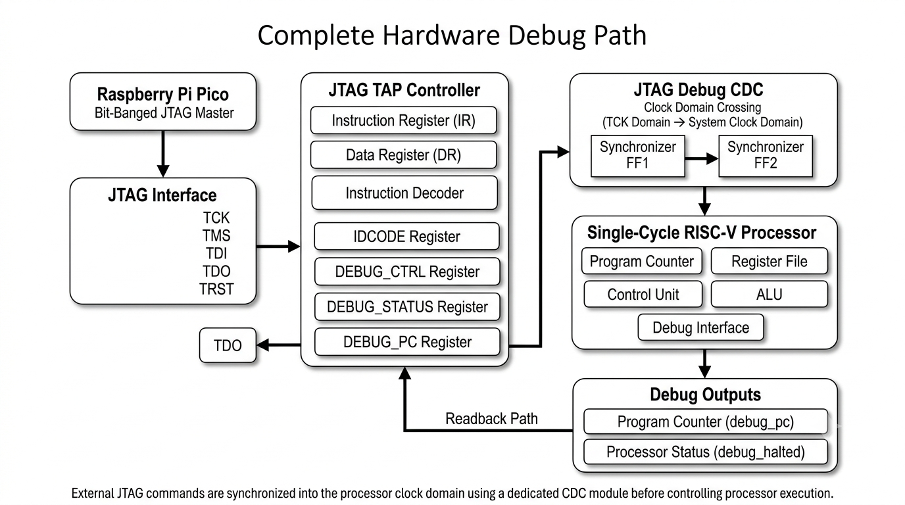
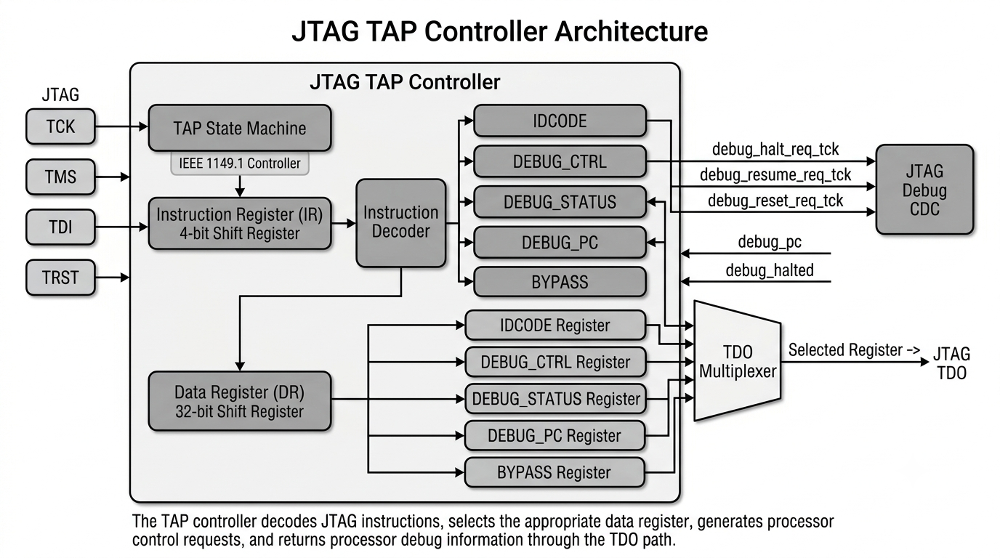
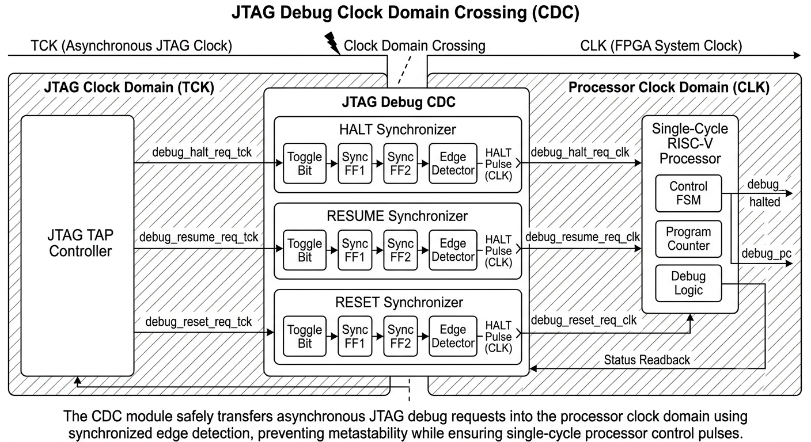
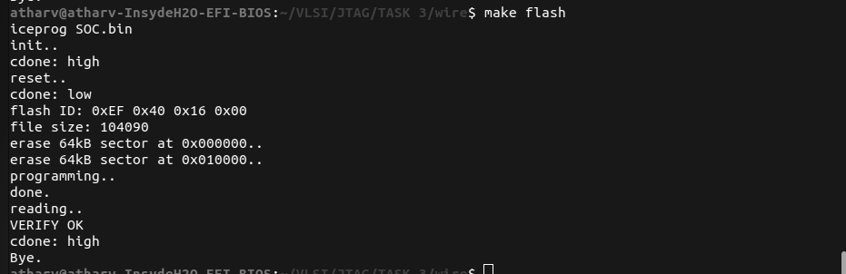
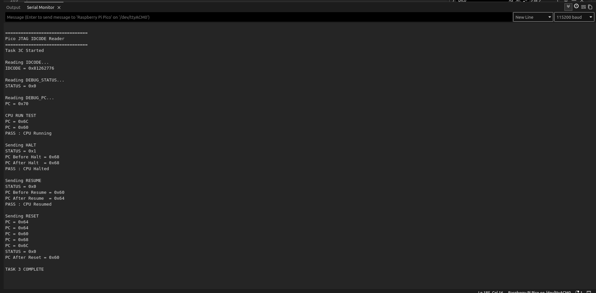

# Task 3C: FPGA Hardware Debug Interface using JTAG

## Overview

This project implements a complete **JTAG-based hardware debug interface** for a custom single-cycle RISC-V processor running on the **VSDSquadron FM FPGA**. The implementation enables an external JTAG master to monitor and control processor execution through a dedicated debug interface.

A **Raspberry Pi Pico** is used as a software-driven JTAG master to communicate with the FPGA. The Pico performs instruction and data register transactions over the IEEE 1149.1 JTAG interface, allowing software running on a host computer to access the processor's internal debug registers.

Unlike simulation-only debugging, this implementation demonstrates **real hardware control** of the processor. The JTAG interface is capable of reading the processor Program Counter (PC), monitoring processor status, and issuing HALT, RESUME, and RESET requests while the processor executes on the FPGA.

To safely communicate between the JTAG clock domain and the processor clock domain, a dedicated **Clock Domain Crossing (CDC)** module is implemented between the JTAG TAP controller and the RISC-V core.

The project demonstrates the complete hardware debug path:

```text
                  Raspberry Pi Pico
               (Bit-Banged JTAG Master)
                          │
                          ▼
                    JTAG Interface
                          │
                          ▼
                  JTAG TAP Controller
                          │
                          ▼
               Clock Domain Crossing
                          │
                          ▼
                 Single-Cycle RISC-V
                          │
                          ▼
          Debug Status / Program Counter
```

---

# Objectives

The primary objectives of this project are:

* Implement a custom IEEE 1149.1 compatible JTAG TAP controller.
* Read the FPGA identification code (IDCODE) over JTAG.
* Implement dedicated debug registers for processor control and observation.
* Safely transfer debug requests from the JTAG clock domain to the processor clock domain using a CDC synchronizer.
* Read the processor Program Counter (PC) through the JTAG interface.
* Halt processor execution using an external JTAG command.
* Resume processor execution after a halt request.
* Reset the processor through the debug interface.
* Verify all debug functionality on real FPGA hardware using a Raspberry Pi Pico as the JTAG master.

---

# Features

The implemented debug interface supports the following functionality.

| Feature                         |
| ------------------------------- | 
| IEEE 1149.1 JTAG TAP Controller |
| IDCODE Register                 |
| DEBUG_CTRL Register             |
| DEBUG_STATUS Register           |
| DEBUG_PC Register               |
| JTAG Instruction Register (IR)  |
| JTAG Data Register (DR)         |
| Clock Domain Crossing (CDC)     |
| Processor HALT                  |
| Processor RESUME                |
| Processor RESET                 |
| Program Counter Readback        |
| Raspberry Pi Pico JTAG Master   |
| Hardware Verification on FPGA   |

---

# Project Structure

The project is organized into hardware design files, Pico firmware, build scripts, generated logs, and hardware documentation.

```text
Task-3C/
├── src/
│   ├── emitter_uart.v
│   ├── riscv.v
│   ├── jtag_tap.v
│   ├── jtag_debug_cdc.v
│   ├── clockworks.v
│   ├── gpio_ctrl_ip.v
│   ├── uart.v
│   ├── timer.v
│   ├── femtopll.v
│   ├── tb_step2.v
│   ├── tb_Step3.v
│   ├── firmware.hex
│   ├── VSDSquadronFM.pcf
│   └── Makefile
│
├── scripts/
│   ├── pico_halt_resume_reader.ino
│   └── README.md
│
├── logs/
│   ├── synth.log
│   ├── pnr.log
│   ├── timing.log
│   └── programming.log
│
├── images/
│   ├── system_architecture.png
│   ├── jtag_tap_controller_architecture.png
│   ├── cdc_architecture.png
│   ├── fpga_bitstream.png
│   ├── wiring.jpg
│   ├── pico_output.png
│   └── hardware_debug_path.png
│
└── README.md
```

---

# System Architecture

The implemented hardware architecture consists of four major components:

1. **Raspberry Pi Pico** acting as a software-based JTAG master.
2. **Custom JTAG TAP Controller** implementing the IEEE 1149.1 state machine and debug registers.
3. **Clock Domain Crossing (CDC)** module that safely transfers debug requests between the JTAG clock domain and the processor clock domain.
4. **Single-Cycle RISC-V Processor** supporting external debug control.

The overall data flow is illustrated below.

## Hardware Debug Path
<p align="center">
  
</p>

The Raspberry Pi Pico communicates with the FPGA exclusively through the JTAG interface. Debug requests generated by the Pico are decoded by the JTAG TAP controller and synchronized into the processor clock domain using the CDC module. The processor executes the requested operation and exposes its current Program Counter and debug status back to the TAP controller, allowing them to be read through subsequent JTAG transactions.

# RTL Design and Hardware Implementation

## Top-Level Hardware Architecture

The FPGA design is implemented using the `SOC` module, which serves as the top-level integration module for the complete system. It instantiates the processor, memory, peripherals, JTAG debug interface, and the Clock Domain Crossing (CDC) synchronizer.

The architecture is organized such that the JTAG logic operates independently of the processor clock. Any debug command received through the JTAG interface is first synchronized into the processor clock domain before being acted upon by the RISC-V core.

The major hardware blocks are:

* System-on-Chip (`SOC`)
* Custom JTAG TAP Controller
* JTAG Debug CDC Synchronizer
* Single-Cycle RISC-V Processor
* On-chip Memory
* GPIO Peripheral
* UART Peripheral
* Timer Peripheral

The overall RTL hierarchy is shown below.

```text
                           SOC
                            │
        ┌───────────────────┼────────────────────┐
        │                   │                    │
        ▼                   ▼                    ▼
   JTAG TAP           Debug CDC           RISC-V Processor
        │                   │                    │
        │                   │                    │
        ▼                   ▼                    ▼
  Debug Registers     Synchronizers        Memory Interface
                                                │
                              ┌─────────────────┼────────────────┐
                              ▼                 ▼                ▼
                           Memory             GPIO             UART
                                                │
                                                ▼
                                              Timer
```

---

# JTAG TAP Controller

The JTAG TAP controller implements the IEEE 1149.1 Test Access Port state machine and provides the interface between the external JTAG master and the processor debug logic.

The controller is responsible for:

* Managing the TAP finite state machine
* Shifting instructions into the Instruction Register (IR)
* Shifting data into and out of the Data Register (DR)
* Decoding JTAG instructions
* Accessing debug registers
* Generating processor control requests

The implemented instruction set is summarized below.

| Instruction  | Opcode | Function                       |
| ------------ | :----: | ------------------------------ |
| IDCODE       |  `0x1` | Read FPGA identification code  |
| DEBUG_CTRL   |  `0x2` | Write processor debug commands |
| DEBUG_STATUS |  `0x3` | Read processor status          |
| DEBUG_PC     |  `0x4` | Read processor Program Counter |
| BYPASS       |  `0xF` | Select bypass register         |

The TAP controller implements the standard IEEE 1149.1 state transitions.


## JTAG TAP Controller Architecture
<p align="center">
  
</p>


This diagram should illustrate:

* TAP FSM
* Instruction Register
* Data Register
* Instruction Decoder
* Debug Registers
* TDO Multiplexer

---

# Debug Register Implementation

Four registers are implemented to support processor debugging.

### IDCODE

The IDCODE register contains the fixed FPGA identification value.

```
IDCODE = 0x81262776
```

This register allows the external JTAG master to verify communication with the FPGA.

---

### DEBUG_CTRL

The DEBUG_CTRL register is used to send control commands from the JTAG master to the processor.

|  Bit | Function       |
| ---: | -------------- |
|    0 | HALT Request   |
|    1 | RESUME Request |
|    2 | RESET Request  |
| 31:3 | Reserved       |

Supported command values are:

| Command | Value        |
| ------- | ------------ |
| HALT    | `0x00000001` |
| RESUME  | `0x00000002` |
| RESET   | `0x00000004` |

When the register is updated during the JTAG `UPDATE_DR` state, the TAP controller generates a single-cycle request pulse that is forwarded to the CDC synchronizer.

---

### DEBUG_STATUS

The DEBUG_STATUS register reports the current processor execution state.

Current implementation:

|        Value | Meaning           |
| -----------: | ----------------- |
| `0x00000000` | Processor Running |
| `0x00000001` | Processor Halted  |

The least significant bit directly reflects the processor's `debug_halted` signal.

---

### DEBUG_PC

The DEBUG_PC register provides read-only access to the current Program Counter of the processor.

This register allows external software to observe processor execution without modifying the processor state.

Typical behavior:

* While running, consecutive reads return different PC values.
* While halted, consecutive reads return the same PC value.

---

# Clock Domain Crossing (CDC)

The JTAG TAP operates using the external JTAG clock (`TCK`), whereas the processor operates using the FPGA system clock (`CLK`). Since these clocks are asynchronous, directly connecting the debug request signals could lead to metastability and unreliable operation.

To safely transfer control requests, a dedicated CDC module (`jtag_debug_cdc.v`) is inserted between the TAP controller and the processor.

The CDC synchronizer performs the following functions:

* Synchronizes HALT requests
* Synchronizes RESUME requests
* Synchronizes RESET requests
* Generates single-cycle pulses in the processor clock domain

The communication path is illustrated below.

## CDC Architecture
<p align="center">
  
</p>

This figure should show the synchronizer stages and the transfer of request pulses from the JTAG clock domain to the processor clock domain.

---

# Processor Debug Integration

The RISC-V processor was extended with a dedicated hardware debug interface.

The following debug signals were added to the processor:

| Signal             | Direction | Description                      |
| ------------------ | --------- | -------------------------------- |
| `debug_halt_req`   | Input     | Halt request from CDC            |
| `debug_resume_req` | Input     | Resume request from CDC          |
| `debug_reset_req`  | Input     | Reset request from CDC           |
| `debug_halted`     | Output    | Indicates processor halted state |
| `debug_pc`         | Output    | Current Program Counter          |

When a HALT request is received, the processor enters a halted state by freezing the execution state machine while preserving the current Program Counter.

Upon receiving a RESUME request, normal instruction execution resumes from the stored Program Counter.

A RESET request reinitializes the processor state and restarts execution from the reset vector.

This hardware interface allows complete processor control without requiring any modifications to the instruction set or application software.

## Simulation

Before hardware validation, the design was verified using simulation.

| Testbench | Purpose |
|------------|----------|
| tb_step2.v | CPU debug verification |
| tb_step3.v | Complete JTAG + CDC + CPU verification |

Simulation waveforms confirmed correct JTAG state transitions, debug register access, and processor HALT/RESUME behavior prior to FPGA deployment.


# FPGA Build and Hardware Validation

## FPGA Build Flow

The FPGA design is synthesized, placed, routed, and converted into a configuration bitstream using the open-source IceStorm toolchain.

The complete build process is automated using the provided `Makefile`.

### Build Flow

```text
Verilog Source Files
        │
        ▼
      Yosys
(Synthesis)
        │
        ▼
SOC.json
        │
        ▼
nextpnr-ice40
(Place & Route)
        │
        ▼
SOC.asc
        │
        ▼
icepack
(Bitstream Generation)
        │
        ▼
SOC.bin
        │
        ▼
iceprog
(FPGA Programming)
```

The generated files are summarized below.

| File | Description |
|------|-------------|
| `SOC.json` | Synthesized netlist generated by Yosys |
| `SOC.asc` | Place-and-route output generated by nextpnr |
| `SOC.bin` | FPGA configuration bitstream |
| `SOC.timings` | Timing report generated by icetime |

---

# Build Commands

The following commands are used during development.

### Build FPGA Bitstream

```bash
make
```

### Timing Analysis

```bash
make timing
```

### Program FPGA

```bash
make flash
```

or

```bash
make prog
```

### Clean Generated Files

```bash
make clean
```

---

# Build Logs

The Makefile automatically stores build logs inside the `logs/` directory.

```text
logs/

├── synth.log
├── pnr.log
├── timing.log
└── programming.log
```

These logs contain the synthesis report, place-and-route report, timing analysis, and FPGA programming output respectively.

---

# FPGA Pin Mapping

The FPGA pin assignments are specified in the `VSDSquadronFM.pcf` constraints file.

The design exposes the following JTAG interface signals.

| FPGA Signal | Description |
|-------------|-------------|
| `tck` | JTAG Test Clock |
| `tms` | JTAG Test Mode Select |
| `tdi` | Test Data Input |
| `tdo` | Test Data Output |
| `trst` | TAP Reset |

The processor operates from the onboard FPGA system clock while the JTAG TAP is driven independently using the external JTAG clock supplied by the Raspberry Pi Pico.

## FPGA Bitstream
<p align="center">
  
</p>

---

# Raspberry Pi Pico Firmware

A Raspberry Pi Pico is used as a software-based JTAG master.

Instead of using dedicated JTAG hardware, the Pico generates JTAG transactions by manually toggling its GPIO pins (bit-banging).

The firmware is located in

```text
scripts/pico_halt_resume_reader.ino
```

The firmware implements reusable helper functions for JTAG communication.

| Function | Description |
|----------|-------------|
| `tapReset()` | Reset the JTAG TAP controller |
| `loadInstruction()` | Shift a 4-bit JTAG instruction into the Instruction Register |
| `readDR()` | Read a 32-bit Data Register |
| `writeDR()` | Write a 32-bit Data Register |
| `readRegister()` | Read a selected debug register |
| `writeRegister()` | Write to the DEBUG_CTRL register |

---

# Pico GPIO Connections

The Pico communicates directly with the FPGA through the JTAG interface.

| Raspberry Pi Pico | FPGA Signal |
|-------------------|-------------|
| GPIO 5 | TCK |
| GPIO 6 | TMS |
| GPIO 8 | TDI |
| GPIO 10 | TDO |
| GPIO 12 | TRST |
| GND | GND |

All communication uses **3.3 V logic levels**.

**Important**

- FPGA and Pico must share a common ground.
- Do not use 5 V JTAG signals.

---

# Hardware Test Procedure

After programming the FPGA, the Pico firmware performs the following sequence.

```text
Reset TAP
      │
      ▼
Read IDCODE
      │
      ▼
Read DEBUG_STATUS
      │
      ▼
Read DEBUG_PC
      │
      ▼
Verify CPU Running
      │
      ▼
Send HALT Command
      │
      ▼
Verify STATUS = Halted
      │
      ▼
Verify PC Frozen
      │
      ▼
Send RESUME Command
      │
      ▼
Verify STATUS = Running
      │
      ▼
Verify PC Changes
      │
      ▼
Send RESET Command
      │
      ▼
Verify Processor Restart
```

---

# Validation Method

The correctness of the implementation is verified using three independent observations.

## 1. IDCODE Verification

The Pico first reads the FPGA IDCODE.

Expected value:

```text
0x81262776
```

This confirms that the physical JTAG connection and TAP controller are functioning correctly.

---

## 2. Processor Status Verification

The firmware reads the `DEBUG_STATUS` register before and after issuing HALT and RESUME commands.

Current implementation:

| Status Value | Meaning |
|-------------|---------|
| `0x00000000` | Processor Running |
| `0x00000001` | Processor Halted |

---

## 3. Program Counter Verification

The `DEBUG_PC` register is read multiple times to verify processor execution.

Expected behaviour:

Running Processor

```text
PC1 ≠ PC2
```

Processor Halted

```text
PC1 = PC2
```

Processor Resumed

```text
PC1 ≠ PC2
```

This confirms that processor execution actually stops during HALT and resumes correctly after a RESUME command.

---


The following figures should accompany this section.


These images document the complete hardware validation process, from FPGA compilation and programming to successful processor control using the Raspberry Pi Pico.

# Experimental Results

The complete JTAG debug interface was successfully implemented and validated on the VSDSquadron FM FPGA using a Raspberry Pi Pico as the external JTAG master.

The Pico firmware communicated with the custom JTAG TAP controller to perform instruction and data register transactions. The FPGA responded correctly to all supported debug operations, demonstrating successful integration of the JTAG TAP controller, Clock Domain Crossing (CDC) module, and the modified RISC-V processor.

The following debug features were verified on hardware:

| Feature | Result |
|---------|:------:|
| JTAG Communication | ✅ |
| IDCODE Read | ✅ |
| DEBUG_STATUS Read | ✅ |
| DEBUG_PC Read | ✅ |
| Processor HALT | ✅ |
| Processor RESUME | ✅ |
| Processor RESET | ✅ |
| Program Counter Freeze | ✅ |
| Program Counter Resume | ✅ |

---

# Hardware Verification

## Reading FPGA IDCODE

The first hardware test verifies the physical JTAG connection by reading the FPGA identification register.

Observed output:

```text
Reading IDCODE...
IDCODE = 0x81262776
```

The returned value matches the implemented IDCODE register, confirming that the Raspberry Pi Pico successfully communicates with the FPGA over the JTAG interface.

---

## Processor Running Verification

Before issuing any debug commands, the processor execution is verified by repeatedly reading the Program Counter.

Observed output:

```text
CPU RUN TEST

PC = 0x60
PC = 0x60
PC = 0x68

PASS : CPU Running
```

The changing Program Counter confirms that the processor is executing instructions normally.

---

## HALT Verification

The Pico writes a HALT request to the `DEBUG_CTRL` register.

Observed output:

```text
Sending HALT

STATUS = 0x1

PC Before Halt = 0x70
PC After Halt  = 0x70

PASS : CPU Halted
```

After the HALT command:

- The processor reports the halted status.
- Consecutive Program Counter reads return the same value.
- This confirms that instruction execution has stopped while the processor state is preserved.

---

## RESUME Verification

The Pico then issues a RESUME request.

Observed output:

```text
Sending RESUME

STATUS = 0x0

PC = 0x68
PC = 0x60
PC = 0x70
PC = 0x6C
PC = 0x64
PC = 0x68
PC = 0x70
```

The Program Counter begins changing again, demonstrating that normal processor execution has resumed.

---

## RESET Verification

The RESET request is implemented as an additional debug feature.

Observed output:

```text
Sending RESET

PC = 0x6C
PC = 0x68
PC = 0x64
PC = 0x60
PC = 0x6C

STATUS = 0x0

PC After Reset = 0x68
```

The processor successfully restarts execution following the RESET request.


## Pico Output


---

# Summary of Implemented Debug Features

The implemented JTAG debug interface supports the following processor control features.

| Debug Feature | Description |
|--------------|-------------|
| IDCODE | Reads FPGA identification register |
| DEBUG_STATUS | Reports processor execution state |
| DEBUG_PC | Reads the current Program Counter |
| HALT | Stops processor execution |
| RESUME | Continues processor execution |
| RESET | Restarts the processor |
| CDC Synchronizer | Safely transfers debug requests between clock domains |

---

# Generated Build Files

Building the project generates the following FPGA implementation files.

| File | Description |
|------|-------------|
| `SOC.json` | Synthesized design |
| `SOC.asc` | Place-and-route output |
| `SOC.bin` | FPGA configuration bitstream |
| `SOC.timings` | Timing analysis report |

The Makefile also generates build logs.

```text
logs/

├── synth.log
├── pnr.log
├── timing.log
└── programming.log
```

---

# Conclusion

This project successfully demonstrates a custom hardware debug interface for a RISC-V processor implemented on the VSDSquadron FM FPGA.

A complete IEEE 1149.1 compatible JTAG TAP controller was developed and integrated with the processor through a dedicated Clock Domain Crossing (CDC) synchronizer. The Raspberry Pi Pico was used as an external JTAG master to communicate with the FPGA, providing a low-cost and flexible hardware debugging platform.

The implemented debug registers enable external observation and control of processor execution through the JTAG interface. Hardware validation confirmed successful execution of all implemented debug operations, including:

- Reading the FPGA IDCODE
- Reading the processor Program Counter
- Reading processor execution status
- Halting processor execution
- Resuming processor execution
- Resetting the processor

The observed hardware behaviour matched the intended functionality, confirming correct operation of the JTAG TAP controller, CDC synchronizer, and processor debug logic.

This implementation establishes a solid foundation for more advanced hardware debugging features such as hardware breakpoints, single-step execution, and integration with standard debugging tools.

---

