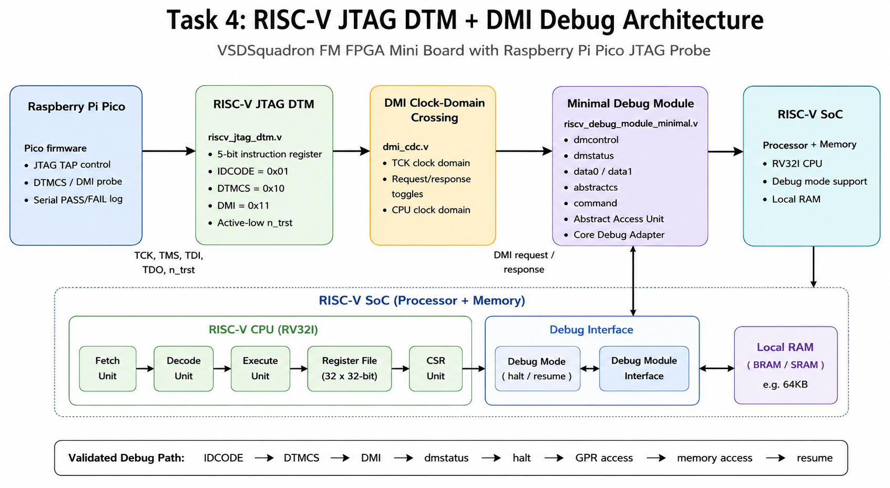
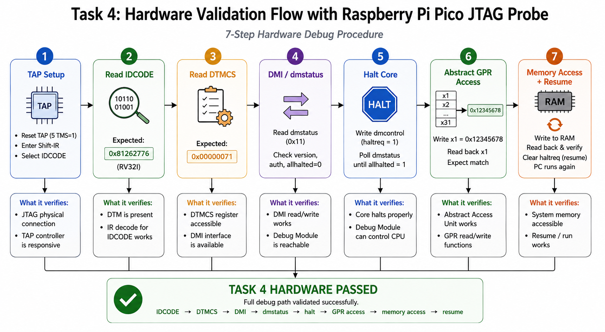
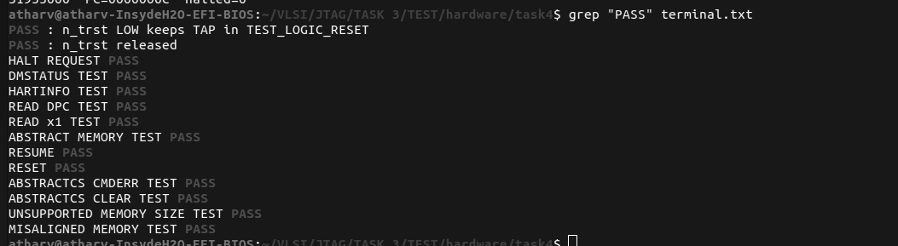
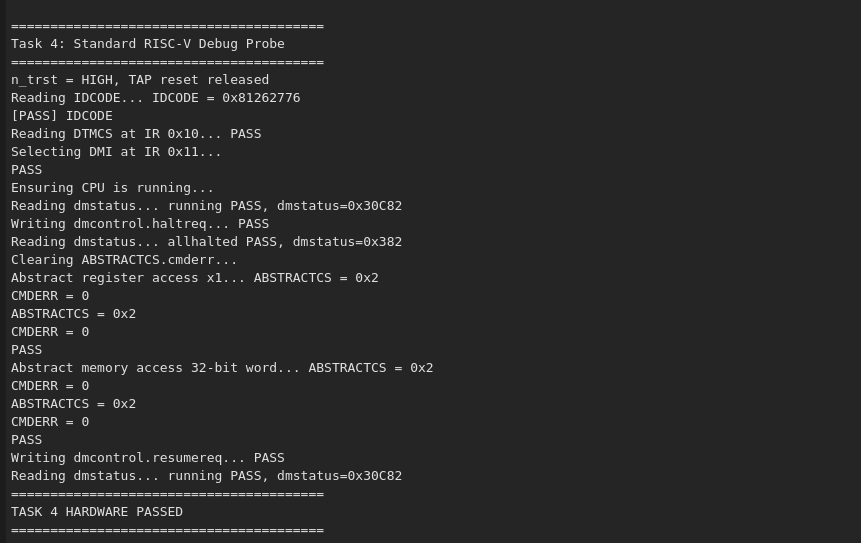

# Task 4 — RISC-V JTAG DTM + DMI Debug Path

## 1. Overview

This project implements a minimal RISC-V Debug Specification aligned debug path for the VSDSquadron FM FPGA Mini board.

The external debug path is:

```text
Raspberry Pi Pico
      │ JTAG: TCK / TMS / TDI / TDO / n_trst
      ▼
RISC-V JTAG Debug Transport Module (DTM)
      ▼
DMI clock-domain crossing
      ▼
Minimal Debug Module (DM)
      ▼
Core debug adapter + abstract access unit
      ▼
RISC-V core and local RAM
```

The Pico acts as a standard JTAG DTM/DMI probe. It does not use custom external `DEBUG_CTRL`, `DEBUG_STATUS`, or `DEBUG_PC` JTAG instructions.

## 2. Implemented functionality

| Area | Implementation | Observed result |
|---|---|---|
| JTAG instruction register | 5-bit IR | Working |
| IDCODE | IR `0x01`, expected value `0x81262776` | PASS |
| DTMCS | IR `0x10`, expected value `0x00000071` | PASS |
| DMI | IR `0x11`, 41-bit request/response scan | PASS |
| TAP reset | Active-low `n_trst`; held HIGH during normal operation | PASS |
| Run control | `dmcontrol.haltreq` and `dmcontrol.resumereq` | PASS |
| Status | `dmstatus` reports running and halted states | PASS |
| Abstract register access | Write/read GPR x1 while halted | PASS |
| Abstract memory access | Aligned 32-bit read/write at address `0x00000080` | PASS |

## 3. Architecture

### Architecture diagram

## Architecture

<p align="center">
  
</p>

The Pico communicates with the FPGA over standard JTAG. The JTAG DTM exposes IDCODE, DTMCS, and DMI. DMI requests cross from the TCK domain into the CPU clock domain, where the minimal Debug Module controls the core and the Abstract Access Unit accesses GPRs and local RAM.

## Hardware probe flow

<p align="center">
  
</p>

The Pico runs this sequence once after reset and prints the final result through USB serial.


## 4. RTL modules

| Module | Purpose |
|---|---|
| `riscv_jtag_dtm.v` | JTAG TAP controller, IDCODE, DTMCS, DMI scan register, active-low `n_trst` handling |
| `dmi_cdc.v` | Transfers DMI requests and responses between the TCK and CPU clock domains |
| `dmi_interface.v` | Presents a request/response interface to the Debug Module |
| `riscv_debug_module_minimal.v` | Implements `dmcontrol`, `dmstatus`, `hartinfo`, `data0`, `data1`, `abstractcs`, and `command` |
| `core_debug_adapter.v` | Converts `dmcontrol` bits into core halt, resume, and reset requests |
| `abstract_access_unit.v` | Executes abstract GPR and aligned 32-bit memory operations while the core is halted |
| `riscv.v` | RISC-V processor debug interface, register-file access, and halted-state control |

## 5. JTAG wiring

Connect the Raspberry Pi Pico and FPGA using 3.3 V logic only. A common ground is mandatory.

| Pico GPIO | FPGA signal | Direction |
|---|---|---|
| GP5 | `tck` | Pico → FPGA |
| GP6 | `tms` | Pico → FPGA |
| GP8 | `tdi` | Pico → FPGA |
| GP10 | `tdo` | FPGA → Pico |
| GP12 | `n_trst` / `trst` | Pico → FPGA |
| GND | GND | Common reference |

> Do not apply 5 V to FPGA JTAG signals.

## 6. Pico firmware

The Pico firmware contains:

- `jtag.cpp` / `jtag.h`: TAP movement and IR/DR scan helpers.
- `idcode.cpp` / `idcode.h`: IDCODE scan and verification.
- `dtm.cpp` / `dtm.h`: DTMCS, DMI, DMSTATUS, halt/resume, and abstract access tests.
- `PicoJTAG.ino`: single-run entry point.

The Pico initializes the JTAG GPIO pins, drives `n_trst` HIGH during normal operation, resets the TAP, and runs the hardware probe once.

Use the following final entry point:

```cpp
#include "jtag.h"
#include "dtm.h"

void setup() {
    Serial.begin(115200);
    delay(2000);

    jtag_init();
    run_task4_hardware_probe();
}

void loop() {
}
```

## 7. Simulation

The simulation testbench `sim/tb_soc_debug.v` covers:

- `n_trst` reset behavior: TAP held in reset when `n_trst` is LOW, released when HIGH.
- IDCODE and DTMCS scans.
- DMI `dmstatus` access.
- Halt and resume through `dmcontrol`.
- Abstract DPC and GPR access.
- Abstract 32-bit memory read/write.
- `abstractcs.cmderr` behavior for unsupported and misaligned commands.

<p align="center">
  
</p>

The simulation must print `TASK 4 COMPLETED` (or equivalent PASS messages) before the hardware is tested.


The simulation file is included in the repository under `sim/`.

## 8. Build and program

1. Place the final RTL files in the FPGA project RTL directory.
2. Confirm the top-level PCF constrains the top-level ports `tck`, `tms`, `tdi`, `tdo`, and `trst`/`n_trst` to the pins used in the wiring table.
3. Build the FPGA project with the project Makefile or the Yosys/nextpnr/icepack flow used by this board project.
4. Program the generated FPGA bitstream using the project programming procedure, for example `iceprog <bitstream>.bin` if the project produces an iCE40 `.bin` file.
5. Build and upload the Pico firmware.
6. Open the Pico serial monitor at `115200` baud.

## 9. Hardware test procedure

### Step 1 — Program and connect

1. Program the FPGA with the final debug-enabled bitstream.
2. Connect Pico and FPGA according to the wiring table.
3. Connect Pico USB to the host PC.
4. Open a serial monitor at 115200 baud.
5. Reset the Pico or upload the Pico firmware.

### Step 2 — Observe the probe output

The Pico executes the following sequence automatically:

1. Drives `n_trst` HIGH and resets the IEEE 1149.1 TAP.
2. Reads IDCODE using IR `0x01`.
3. Reads DTMCS using IR `0x10`.
4. Selects DMI using IR `0x11`.
5. Ensures the hart is running and verifies `dmstatus`.
6. Writes `dmcontrol.haltreq` and verifies `allhalted`.
7. Clears `abstractcs.cmderr`.
8. Writes x1 with `0x12345678`, then reads x1 back.
9. Writes RAM word `0x12345678` at aligned address `0x00000080`, then reads it back.
10. Writes `dmcontrol.resumereq` and verifies running state.

## 10. Serial output

<p align="center">
  
</p>

## 11. Status values

The design uses a single hart. The expected `dmstatus` values are:

| CPU state | Expected value | Interpretation |
|---|---:|---|
| Running | `0x00030C82` | `anyrunning=1`, `allrunning=1`, authenticated, debug version 2 |
| Halted | `0x00000382` | `anyhalted=1`, `allhalted=1`, authenticated, debug version 2 |

The exact value is checked by fields in firmware, not by comparing the entire 32-bit word alone.

## 12. DMI request handling note

DMI responses are pipelined. A newly shifted DMI request does not return its own response in the same scan. The Pico firmware sends the request, flushes the previous response with a NOP scan, and then collects the requested response with a subsequent NOP scan. This avoids reading a valid-but-stale response belonging to the prior DMI operation.

## 13. Evidence

The following artifacts are included in this submission:

- `sim/tb_soc_debug.v`: simulation testbench covering JTAG, DMI, halt/resume, and abstract access.
- `logs/hardware_probe.log`: raw serial output from the Pico.
- `images/terminal_output.png`: screenshot of the terminal showing `TASK 4 HARDWARE PASSED`.
- `logs/synthesis.log`, `logs/pnr.log`, `logs/timing.log`, `logs/programming.log`: FPGA build and programming logs.
- `images/task4_debug_architecture.png` and `images/task4_hardware_probe_flow.png`: architecture and validation-flow diagrams.

## 14. Implementations

Implemented in this Task 4 design:

- Standard JTAG DTM, DTMCS, and DMI path.
- Single-hart `dmcontrol` / `dmstatus` run control.
- GPR abstract register access.
- Basic aligned 32-bit abstract memory read/write.

## 15. Result

The VSDSquadron FM board successfully exposes a minimal RISC-V Debug Specification aligned JTAG DTM + DMI debug path. The Pico hardware probe verifies IDCODE, DTMCS, DMI status, halt/resume control, abstract GPR access, and aligned 32-bit abstract memory access.
