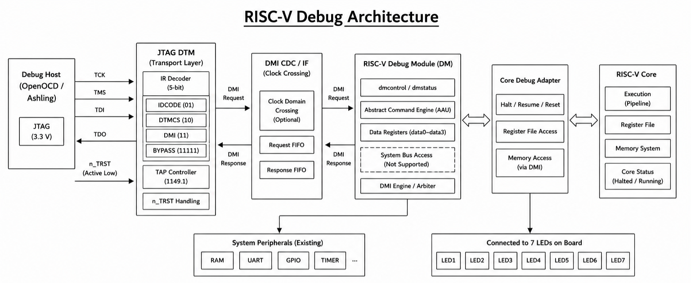
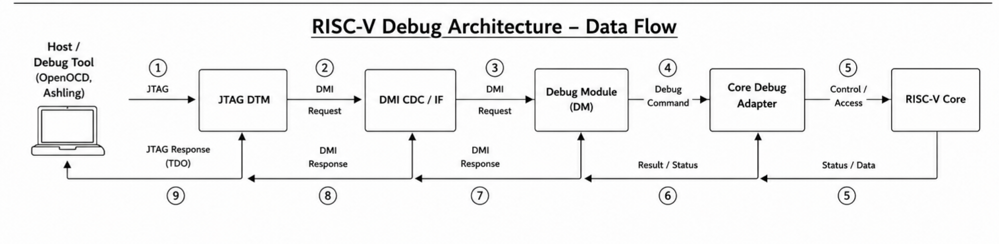
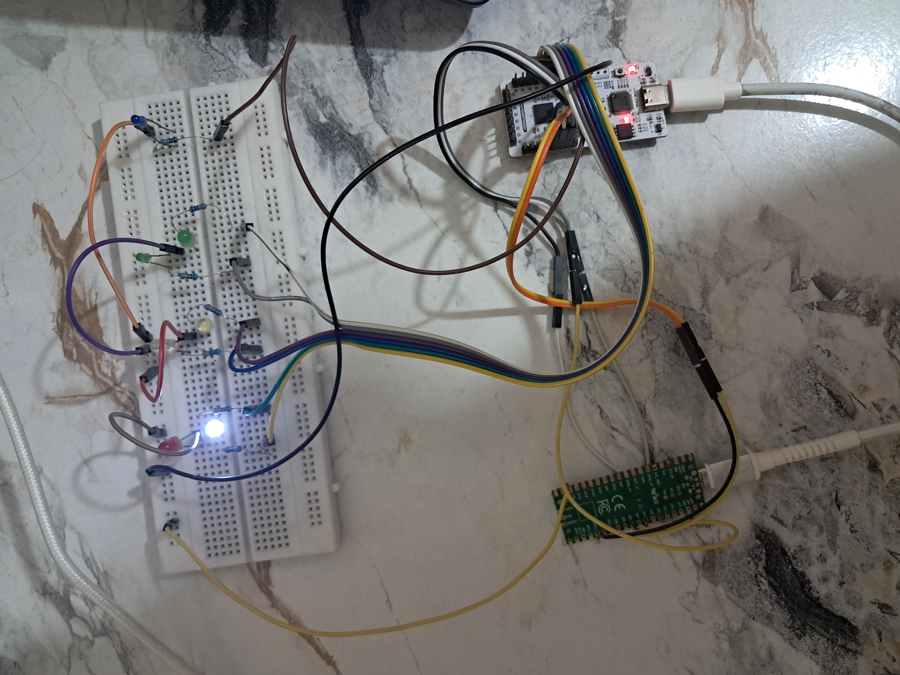
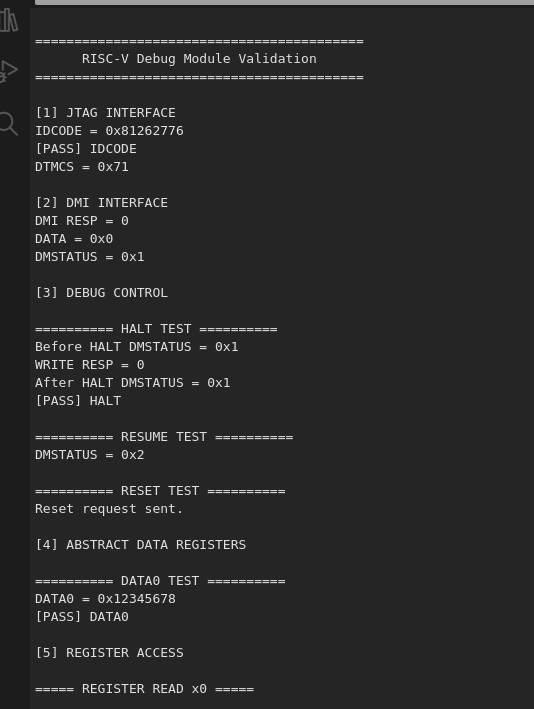
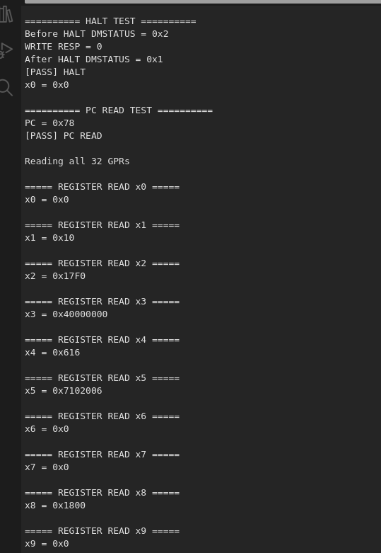
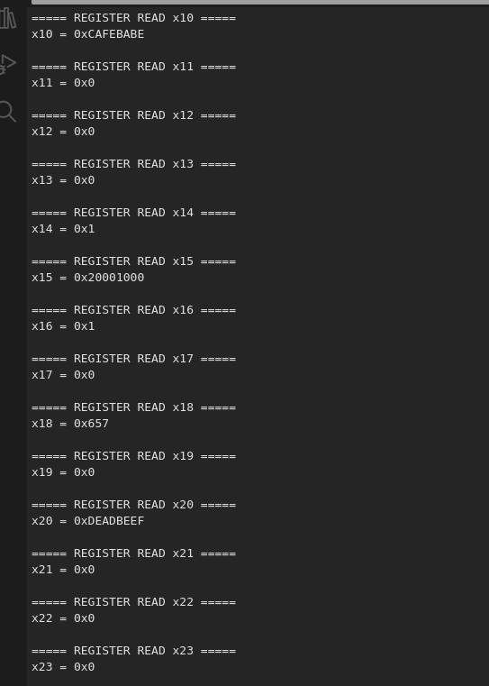
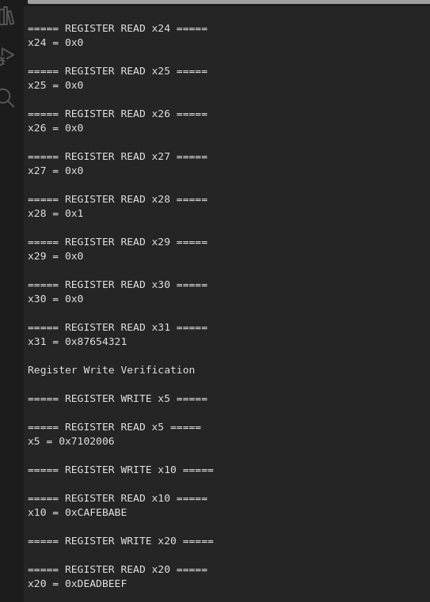
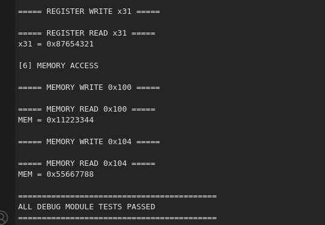
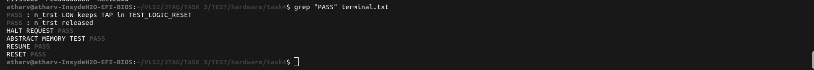

# Overview

This project implements a **minimal RISC-V Debug Subsystem** based on the **RISC-V External Debug Specification** for a custom 32-bit RISC-V processor running on the **VSDSquadron FM (Lattice iCE40UP5K)** FPGA.

The design replaces a custom JTAG debug interface with a standards-oriented architecture consisting of a **JTAG Debug Transport Module (DTM)**, **Debug Module Interface (DMI)**, **Minimal Debug Module (DM)**, **Core Debug Adapter**, and **Abstract Access Unit (AAU)**. Together, these modules enable external debugging of the processor through a standard JTAG interface.

The implementation supports essential debug operations including processor **HALT**, **RESUME**, **RESET**, **Abstract Register Access**, **Abstract Memory Access**, and the standard JTAG instructions **IDCODE**, **DTMCS**, **DMI**, and **BYPASS**.

The complete design was verified through simulation and successfully deployed on the **VSDSquadron FM FPGA**, with hardware validation performed using a **Raspberry Pi Pico** configured as a JTAG debugger.

---

## Key Features

- IEEE 1149.1 compliant JTAG TAP Controller
- 5-bit JTAG Instruction Register
- Support for **IDCODE**, **DTMCS**, **DMI**, and **BYPASS** instructions
- Debug Module Interface (DMI)
- Minimal RISC-V Debug Module
- Processor HALT, RESUME, and RESET control
- Abstract Register Access
- Abstract Memory Access
- Clock Domain Crossing (CDC) between JTAG and system clock
- FPGA implementation on VSDSquadron FM (Lattice iCE40UP5K)
- Hardware validation using Raspberry Pi Pico

# Features

### JTAG Debug Transport Module (DTM)

- IEEE 1149.1 compliant TAP Controller
- 5-bit JTAG Instruction Register (IR)
- Supports standard JTAG instructions:
  - IDCODE
  - DTMCS
  - DMI
  - BYPASS
- Active-low **nTRST** support

---

### Debug Module Interface (DMI)

- Standard DMI request-response protocol
- Read and write transactions
- Communication between the DTM and Debug Module
- Error and response status handling

---

### Minimal Debug Module (DM)

- DMCONTROL register implementation
- DMSTATUS register implementation
- COMMAND register support
- ABSTRACTCS register support
- DATA0 register support
- Single-hart debug support

---

### Processor Debug Features

- Processor HALT
- Processor RESUME
- Processor RESET
- Running/Halted status reporting
- Debug state monitoring

---

### Abstract Access

- General Purpose Register (GPR) Read
- General Purpose Register (GPR) Write
- 32-bit Memory Read
- 32-bit Memory Write

---

### Clock Domain Crossing (CDC)

- Synchronization between JTAG (`TCK`) and processor (`CLK`)
- Safe transfer of debug requests
- Single-cycle pulse generation for HALT, RESUME, and RESET
- Reliable status synchronization

---

### FPGA Implementation
# Overview
- Target Board: **VSDSquadron FM**
- FPGA: **Lattice iCE40UP5K**
- Open-source FPGA toolchain
- Raspberry Pi Pico used as JTAG debugger

---

### Verification

- Functional simulation using **Icarus Verilog**
- Waveform analysis using **GTKWave**
- System-level verification with `tb_soc_debug.v`
- Hardware validation on FPGA

## Supported Operations

| Operation | Status |
|----------|:------:|
| TAP Reset (nTRST) | ✅ |
| IDCODE Read | ✅ |
| DTMCS Read | ✅ |
| DMI Read/Write | ✅ |
| HALT Processor | ✅ |
| RESUME Processor | ✅ |
| RESET Processor | ✅ |
| Register Access | ✅ |
| Memory Access | ✅ |
| FPGA Validation | ✅ |

# System Architecture

The debug subsystem follows the layered architecture defined by the **RISC-V External Debug Specification**, separating the JTAG transport layer from the processor-specific debug logic. This modular organization simplifies integration, verification, and future expansion while maintaining compatibility with standard RISC-V debugging concepts.

The complete debug path consists of six major components that together enable communication between an external JTAG debugger and the RISC-V processor.

<p align="center">
    
</p>

<p align="center">
<b>Figure 1.</b> High-Level RISC-V Debug Architecture
</p>

---

## Architecture Overview

| Component | Description |
|-----------|-------------|
| **JTAG Debugger** | External debugger (Raspberry Pi Pico) that sends JTAG commands. |
| **Debug Transport Module (DTM)** | Implements the JTAG TAP controller and translates JTAG transactions into DMI requests. |
| **Debug Module Interface (DMI)** | Communication interface between the DTM and Debug Module. |
| **Debug Module (DM)** | Processes debug commands and controls processor execution. |
| **Core Debug Adapter** | Converts debug requests into processor-specific control signals. |
| **Abstract Access Unit (AAU)** | Performs register and memory access operations while the processor is halted. |
| **RISC-V Processor** | Executes user programs and responds to debug requests. |

---

## Debug Communication Flow

Every debug operation follows the same communication path:

<p align="center">
    
</p>

<p align="center">
<b>Figure 2.</b> High-Level RISC-V Data Communication Flow
</p>
---

## Supported Debug Operations

The implemented architecture supports:

- Reading **IDCODE**
- Reading **DTMCS**
- DMI read/write transactions
- Processor **HALT**
- Processor **RESUME**
- Processor **RESET**
- Abstract Register Access
- Abstract Memory Access
- Active-low **nTRST** reset

All operations were verified through simulation and validated on the VSDSquadron FM FPGA using a Raspberry Pi Pico as the external JTAG debugger.

# Repository Structure

```
Task-4/
├── images/
│   ├── data_flow.png
│   ├── simulation_verification.png
│   ├── riscv_debug_architecture.png
│   ├── terminal_output_1.png
│   ├── terminal_output_2.png
│   ├── terminal_output_3.png
│   ├── terminal_output_4.png
│   └── terminal_output_5.png
│
├── logs/
│   ├── pnr.log
│   ├── programming.log
│   ├── synth.log
│   └── timing.log
│
├── PicoJTAG/
│   ├── PicoJTAG.ino
│   ├── dtm.cpp
│   ├── dtm.h
│   ├── idcode.cpp
│   ├── idcode.h
│   ├── jtag.cpp
│   └── jtag.h
│
├── rtl/
│   ├── abstract_access_unit.v
│   ├── clockworks.v
│   ├── core_debug_adapter.v
│   ├── dmi_cdc.v
│   ├── dmi_interface.v
│   ├── emitter_uart.v
│   ├── femtopll.v
│   ├── riscv.v
│   ├── riscv_debug_module_minimal.v
│   ├── riscv_jtag_dtm.v
│   └── VSDSquadronFM.pcf
│
├── sim/
│   ├── soc.vcd
│   ├── tb_soc_debug.v
│   └── terminal.txt
│
├── Makefile
│
├── firmware.hex
│
│
└── README.md
```

## Directory Description

| Directory | Description |
|-----------|-------------|
| `images/` | Block diagrams, data flow diagrams, and terminal output screenshots |
| `logs/` | FPGA synthesis, place-and-route, timing, and programming logs |
| `PicoJTAG/` | Raspberry Pi Pico firmware implementing the JTAG interface |
| `rtl/` | Verilog RTL design files, firmware image, constraints, and build Makefile |
| `sim/` | Testbench, simulation waveform (`.vcd`), and terminal output |

# Hardware Requirements

The following hardware was used to build and validate this project.

| Hardware | Purpose |
|----------|---------|
| VSDSquadron FM FPGA Board | Target FPGA platform |
| Lattice iCE40UP5K FPGA | FPGA device |
| Raspberry Pi Pico | External JTAG debugger |
| USB Cable | FPGA programming and serial communication |
| Jumper Wires | JTAG connections |
| Host PC (Ubuntu 22.04 recommended) | Development environment |


# Software Requirements

The project was developed and tested on **Ubuntu 22.04 LTS** using an open-source FPGA toolchain.

| Software | Version | Purpose |
|----------|---------|---------|
| Ubuntu | 22.04 LTS | Development environment |
| Yosys | Latest | RTL synthesis |
| nextpnr-ice40 | Latest | Place and Route |
| IceStorm Tools | Latest | Bitstream generation and FPGA programming |
| Icarus Verilog | Latest | Functional simulation |
| GTKWave | Latest | Waveform visualization |
| Git | Latest | Repository management |
| Visual Studio Code | Latest | Code editing (optional) |

---

## Install Required Packages

Update the package list:

```bash
sudo apt update
```

Install the required tools:

```bash
sudo apt install -y \
git \
iverilog \
gtkwave \
yosys \
nextpnr-ice40 \
fpga-icestorm
```

Verify the installation:

```bash
yosys -V
nextpnr-ice40 --version
iverilog -V
gtkwave --version
```

---

# Hardware Connections

The RISC-V debug subsystem was validated on the **VSDSquadron FM FPGA** using a **Raspberry Pi Pico** configured as a JTAG debugger. The Pico communicates with the FPGA through the standard IEEE 1149.1 JTAG interface.

---

## JTAG Connections

| Raspberry Pi Pico | FPGA Signal | Description |
|-------------------|-------------|-------------|
| GP5 | TCK | Test Clock |
| GP6 | TMS | Test Mode Select |
| GP8 | TDI | Test Data Input |
| GP10 | TDO | Test Data Output |
| GP12 | nTRST | Active-Low TAP Reset |
| GND | GND | Common Ground |

> **Note:** Verify that the GPIO pin assignments in the Pico firmware match the FPGA constraint (`.pcf`) file before running the hardware tests.

---

## Hardware Setup

<p align="center">
    
</p>

<p align="center">
<b>Figure 2.</b> VSDSquadron FM connected to Raspberry Pi Pico
</p>

---

## FPGA Pin Assignment

The JTAG interface is mapped in the FPGA constraint file (`VSDSquadronFM_debug_spec.pcf`).

| FPGA Pin | Signal |
|----------|--------|
| 9 | TCK |
| 10 | TMS |
| 11 | TDI |
| 19 | TDO |
| 21 | nTRST |

> **Note:** Update the pin numbers if your board revision uses a different pin mapping.

---

## Power-Up Procedure

1. Connect the Raspberry Pi Pico to the FPGA using the JTAG wiring shown above.
2. Connect the FPGA board to the host PC via USB.
3. Program the FPGA with the generated bitstream.
4. Reset the TAP controller using **nTRST**.
5. Start the Pico JTAG firmware.
6. Run the verification commands described in the following sections.

Once the hardware is connected, the system is ready for FPGA programming and debug verification.

# Build Instructions

This project uses an open-source FPGA toolchain consisting of **Yosys**, **nextpnr-ice40**, and **IceStorm** tools.

---

## 1. Clone the Repository

```bash
git clone https://github.com/remote-no-code/FPGA-JTAG.git
cd FPGA-JTAG/Task-4
```

---

## 2. Build and Simulate the Design

Simulate the RTL and see waveforms.

```bash
make sim    # Compile with iverilog
make run    # Compile and run (vvp)
make wave   # Compile, run, and open GTKWave
```

```bash
grep "PASS" terminal.txt  #For displaying of the test passed
```


Compile the RTL, synthesize the design, perform place-and-route, and generate the FPGA bitstream.

```bash
make build
```
---

## Build Output

A successful build generates the following files:

```text
build/
├── SOC.json      # Synthesized netlist
├── SOC.asc       # Place-and-route output
└── SOC.bin       # FPGA bitstream
```

---

## Clean Build

To remove all generated files:

```bash
make clean
```

---

## Verify the Build

A successful build should:

- Complete synthesis without errors.
- Complete place-and-route successfully.
- Generate the FPGA bitstream (`top.bin`).
- Program the FPGA successfully.

The FPGA is now ready for hardware validation using the Raspberry Pi Pico JTAG debugger.

# Running the JTAG Debugger

After programming the FPGA, use the Raspberry Pi Pico as the external JTAG debugger to communicate with the RISC-V debug subsystem.

---

## Step 1: Flash the Raspberry Pi Pico

Program the Pico with the JTAG firmware located in the `scripts/` directory.

Example:

1. Hold the **BOOTSEL** button while connecting the Raspberry Pi Pico to your PC.
2. The Pico appears as a USB drive named **`RPI-RP2`**.
3. Open the firmware in **Arduino IDE**.
4. Click **Sketch → Export Compiled Binary**.
5. Click **Sketch → Show Sketch Folder**.
6. Open a terminal in the sketch folder and run:

```bash
cp <file_name>.uf2 /media/$USER/RPI-RP2/
```

7. After copying, the Pico automatically reboots and **Arduino IDE** shows the board as connected.
8. You can verify the connection using:

```bash
lsusb
```

---

## Step 2: Connect the Hardware

Ensure the Pico is connected to the FPGA according to the JTAG wiring described in the **Hardware Connections** section.

| Pico | FPGA |
|------|------|
| GP2 | TCK |
| GP3 | TMS |
| GP4 | TDI |
| GP5 | TDO |
| GP6 | nTRST |
| GND | GND |

---

## Step 3: Open the Serial Terminal

Open a serial terminal at the baud rate configured in the Pico firmware.

Example:

```bash
screen /dev/ttyACM0 115200
```

or

Press Ctrl + Shift + M to open the Serial Monitor, then set the baud rate to 115200.

---

## Step 4: Execute the Debug Tests

Run the JTAG test sequence.

The debugger performs the following operations:

1. Reset the TAP Controller
2. Read IDCODE
3. Read DTMCS
4. Execute DMI transactions
5. Read DMSTATUS
6. Halt the processor
7. Read processor registers
8. Read and write memory
9. Resume processor execution
10. Reset the processor

---

## Terminal Output

<p align="center">
    <br><br>
    <br><br>
    <br><br>
    <br><br>
    
</p>

<p align="center">
<b>Figure 3.</b> Successful Hardware Validation Output
</p>

---

## Troubleshooting

If the expected output is not observed, verify the following:

- FPGA is programmed successfully.
- Pico firmware is uploaded correctly.
- JTAG wiring matches the FPGA constraint file.
- Serial port is correct (`/dev/ttyACM0` or equivalent).
- Baud rate matches the firmware configuration.
- All devices share a common ground.
- The FPGA is powered and running.

Once all tests pass, the RISC-V debug subsystem is fully operational and ready for further development or experimentation.

# Verification Results

The implemented RISC-V debug subsystem was validated through both **functional simulation** and **hardware testing** on the **VSDSquadron FM FPGA**. Each feature was verified individually before performing complete end-to-end system validation.

---

## Simulation Verification

The complete debug subsystem was verified using the `tb_soc_debug.v` testbench.

The simulation validated:

- JTAG TAP Controller operation
- IDCODE instruction
- DTMCS instruction
- DMI read/write transactions
- DMSTATUS register
- Processor HALT
- Processor RESUME
- Processor RESET
- Abstract Register Access
- Abstract Memory Access
- Clock Domain Crossing (CDC)

Simulation completed successfully without functional errors.

<p align="center">
    
</p>

<p align="center">
<b>Figure 4.</b> Functional Simulation Results
</p>

---


## Test Summary

| Test | Simulation | Hardware |
|------|:----------:|:--------:|
| TAP Reset (nTRST) | ✅ | ✅ |
| IDCODE Read | ✅ | ✅ |
| DTMCS Read | ✅ | ✅ |
| DMI Transactions | ✅ | ✅ |
| DMSTATUS Read | ✅ | ✅ |
| Processor HALT | ✅ | ✅ |
| Register Access | ✅ | ✅ |
| Memory Access | ✅ | ✅ |
| Processor RESUME | ✅ | ✅ |
| Processor RESET | ✅ | ✅ |

---

## Validation Outcome

The implemented debug subsystem successfully passed all functional and hardware verification tests.

- ✅ Standards-oriented JTAG debug interface implemented
- ✅ End-to-end DMI communication verified
- ✅ Processor control operations validated
- ✅ Abstract register and memory access verified
- ✅ FPGA implementation successfully demonstrated
- ✅ Hardware operation matched simulation results

These results confirm that the implemented design provides a reliable and functional RISC-V debug subsystem suitable for FPGA-based debugging and future enhancements.

# Conclusion

This project presents the implementation of a **minimal RISC-V Debug Subsystem** based on the **RISC-V External Debug Specification** for a custom 32-bit RISC-V processor on the **VSDSquadron FM (Lattice iCE40UP5K)** FPGA. The design integrates a **JTAG Debug Transport Module (DTM)**, **Debug Module Interface (DMI)**, **Minimal Debug Module (DM)**, **Core Debug Adapter**, and **Abstract Access Unit (AAU)** to provide a standards-oriented debug solution.

The implementation was successfully verified through simulation and validated on FPGA hardware using a **Raspberry Pi Pico** as the JTAG debugger. The completed design supports processor **HALT**, **RESUME**, **RESET**, **Abstract Register Access**, **Abstract Memory Access**, and standard JTAG instructions including **IDCODE**, **DTMCS**, **DMI**, and **BYPASS**. The modular architecture provides a solid foundation for future enhancements such as multi-hart debugging, System Bus Access (SBA), Program Buffer support, and integration with standard RISC-V debugging tools.

